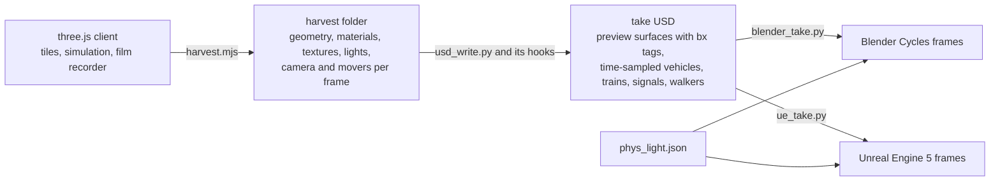

# One city, three renderers

Valdrada renders the same city in three engines. The city is authored and simulated in the three.js client, the
one place that decides what exists, where it is, its size and its class. A recorded take of a camera path is exported
to OpenUSD, and Blender Cycles and Unreal Engine 5 render that export. Nothing flows back from an offline renderer to
the client, and neither offline renderer adds, removes, moves, resizes or reclassifies anything: they differ in how the
same objects look.



## The three stages

**Authoring and simulation (three.js).** The client streams the compiled tiles, runs the traffic, transit and pedestrian
simulation and draws the frame in WebGL2. A shot is a camera path in `tools/ad/shots.json`; the film recorder
(`tools/ad/record.mjs`) plays it and writes the web take. Every change to the city, from a new building rule to a new
material, is made here first.

**Export (OpenUSD).** `boundlessjs/tools/ar34/export/harvest.mjs` opens the client in a headless browser, plays the shot
the way the recorder does and saves the harvest: the geometry within 350 m of the camera path with a coarse city to
4 km, the materials with their shader uniforms and textures, the lights, the camera of every frame, and every vehicle,
train, signal lens and walker per frame. `usd_write.py` turns the harvest into the take's USD layers: the camera, the
moving layer (vehicles and trains as time-sampled point instancers with stable ids and velocities, the signal lenses'
state per frame), the static city with every mesh stored once and instanced, the materials, the lights and the trees.
Its hooks add what the client draws through dedicated shaders:

| Writer hook | Adds to the take |
|---|---|
| `usd_windows.py` | the tile facades as a UV-space bake (albedo, window mask, room emission) in place of their shells, and the window kit's material roles (`bxwin_usd.json`) |
| `usd_trees.py` | the street trees as species prototypes of the bxtrees2 set on the client's tree matrices |
| `usd_mat.py` | per-vertex primvars instead of material variants, and the `bx` tag on every material it can rebuild |
| `usd_peds.py` | the walkers as UsdSkel, and `peds_<shot>.npz` for Blender |
| `usd_ramps.py` | decks under vehicles that the client drives along undecked ramps (see below) |

Every material carries a `UsdPreviewSurface`, so any USD renderer can draw it. A material the writer recognises also
carries the `bx` tag in its customData: a JSON record of its family (`kind`), its pbrLib set name (`set`) for the PBR
library's surfaces, the web shader's uniforms and its texture files. The writer's coplanar pass (`usd_coplanar.py`)
separates surfaces that share a plane and lists the pairs it cannot resolve in `bx_fix.json`. The take folder is the
contract between the stages: the renderers read only the take's USD and the files beside it.

**Rendering (Blender Cycles and Unreal Engine 5).** `blender_take.py` imports the take into Blender 4.5 and runs the
Blender hooks before rendering with Cycles; `ue_take.py` prepares the take for Unreal, imports it in the editor's
command line mode and renders it with Movie Render Queue.

| Stage | Blender Cycles | Unreal Engine 5 |
|---|---|---|
| USD changes | none | `ue_prep.py`: per-vertex data packed into UV sets `st1` to `st3` (Unreal imports four UV sets), time-sampled instancers as animated transforms (Unreal reads an instancer at one time), `ue_<shot>.json` with the tags and the moving instances |
| Import | Blender's USD importer | the USD Stage importer in `UnrealEditor-Cmd`, meshes as Nanite |
| Materials | `blender_nodes.py`: one node-group builder per family | `ue_mat.py`: each tagged material as an instance of its family's master (`ue_project/Python/ue_masters.py`), by the table `ue_families.json` |
| Trees | `blender_trees.py`: translucent two-sided leaves, bark | `ue_trees.py`: Nanite foliage, the masters of `ue_foliage.py`, wind as world position offset |
| Facades | `blender_windows.py`: interior mapping of the rooms behind each window | `M_bx_facade` and the window kit's roles in `ue_families.json` |
| Walkers | `blender_peds.py`: armatures and keyframed poses from `peds_<shot>.npz` | the UsdSkel walkers, recoloured per walker |
| Light | `blender_light.py` | `ue_light.py` |
| Output | `frame_%05d.jpg`, depth | `frame_%05d.jpg`, a data pass of regions and depth (`ue_frames.py`) |

## What reaches every renderer without renderer work

These are data in the take's USD, so a change to them in the client reaches Blender and Unreal at the next export:

| Change in the client | Why it needs no renderer work |
|---|---|
| Geometry and placement: buildings, streets, furniture, landmarks | exported as meshes and instancers with their transforms |
| Vehicles and trains | time-sampled instancers with ids, orientations and velocities; wheel spin and steer as time samples |
| Walkers | UsdSkel bodies and animations (Blender reads the same poses from `peds_<shot>.npz`) |
| Signals | the signal lenses' state per frame as time-sampled scales and visibility |
| Trees | `usd_trees.py` replaces each tree pool of the client by the prototypes of its species form (51 trees of 12 forms in bxtrees2) on the same matrices; forms the set lacks keep the client's trees |
| Materials of an existing family | a material of one of the seven families (`pbr`, `plain`, `untrim`, `vk`, `ground`, `decal`, `sign`) is rebuilt from its `bx` tag, so a new pbrLib set, a new texture or a changed uniform needs nothing else |
| Light | `phys_light.json` holds the exposure per time of day and the sky light's gain, read by both `blender_light.py` and `ue_light.py`; the sun, the street lamps and the vehicle lamps come from the harvest at the client's levels |

Physical light is the default in both renderers (`--light phys`): the visible sky dome is the only sky light, there are
no fill lights, and albedos are not trimmed. `--light web` selects the rig calibrated against the web takes, which the
colour checks use as a baseline.

## What needs work per renderer

A new shader family, one whose uniforms `usd_mat.py` does not recognise, is ported once per renderer: a builder in
`blender_nodes.py` for Blender, a master in `ue_masters.py` with its row in `ue_families.json` for Unreal. Until a
renderer has the port, that renderer draws the family's materials with their standard preview surface (base colour,
roughness, metalness, normal and emission maps as the writer converted them), so the take still renders, with the
web's look reduced to what a preview surface can express.

`frontend_coverage.py` reports, for one take's USD, every material family and pbrLib set and whether each renderer
draws it with its own builder or master, with a high-quality set in Unreal, or on the preview surface. `bx_render_all.mjs`
prints its summary line for every shot of a batch:

```bash
uv run --no-project --with usd-core python boundlessjs/tools/ar34/export/frontend_coverage.py ~/bx/u/t7ArchTrack.usda
```

For the golden hour shot `t7ArchTrack` the take has 1,654 materials: Blender draws 1,571 (95 %) with a builder and
Unreal 1,602 (97 %) with a master; the rest are untagged surfaces on the preview material. Of the take's 36 pbrLib sets,
18 have a high-quality set in Unreal.

## Renderer-specific improvements

A renderer may improve how something looks, never what exists or where. The improvements built so far are in Unreal:

| Improvement | Where | What it changes |
|---|---|---|
| High-quality layered materials | `tools/assets/fetch_hq.py`, `ue_families.json` `hq` | 13 CC0 material sets at 4K (asphalt, sidewalk concrete, granite, brick by colour, stone, concrete, stucco, the viaducts' painted steel and rust) mapped per pbrLib set, per ground kind, per viaduct layer and per facade wall class; each set is tinted to its material's own mean colour and laid at its real size, with a macro tone, a detail normal and cavity grime as extra layers |
| Foliage | `ue_project/Python/ue_foliage.py`, `ue_trees.py` | Nanite trees with a two-sided foliage master: per-instance and per-leaf hue and lightness, the inner crown's occlusion, transmission fitted to the Cycles takes, wind |
| Cinematic preset | `ue_take.py --cine` | 8 temporal samples over a 180 degree shutter, depth of field on the subject, bloom, grain, vignette and light volumetric fog |

Without them (`BXUE_NOHQ=1`, the first tree set, no `--cine`), an Unreal take draws every family from the same tags
and textures as Blender. Blender's interior mapping of the rooms behind the windows is an improvement of the same kind
in Cycles.

The ramp decks are an exception that lives in the shared writer. The client's road graph joins some elevated roads to
the street by ramps that its traffic follows but its road builder does not deck, so the harvest has vehicles driving
through the air. `usd_ramps.py` lays a deck under every such path in the export, asphalt on top and concrete on its
sides, so both offline renderers draw the same deck; the client still draws these ramps without one.

## Checks that keep the renderers coherent

| Check | Tool | Fails a take when |
|---|---|---|
| Colour against the web take | `boundlessjs/tools/ar34/export/cyc_vs_web.py` | off-colour 16 px cells cover more than 0.4 % of the frame, or off-lightness cells more than 2 %, after matching exposure (Cycles and Unreal takes) |
| Regions against both references | `boundlessjs/tools/ar34/export/ue_check.py` | a region (sky, buildings, ground, vegetation, structure) of an Unreal frame leaves the CIELAB band of the web and Cycles takes, or of the Cycles take alone under physical light (`--noweb`), in more than a third of the frames |
| Temporal scan | `tools/ad/temporal_scan.py` | flicker, z-fighting or shimmer between neighbouring frames over its limits |
| Coplanar audit | `usd_coplanar.py`, `bx_fix.json` | more than 100 coplanar surface pairs remain in view |
| Camera clearance | `tools/ad/clearance.mjs` | the lens path crosses a drawn surface, or a vehicle is off the road in view |
| Vehicles | `tools/ad/record.mjs`, `tools/ad/trailerue_vehcheck.py` | parked vehicles stand inside each other in view (the recorder), or two vehicles of the harvest overlap in plan in view (the harvest check, which the offline takes need because they draw the harvest's traffic) |

`bx_render_all.mjs` runs the geometry check after the USD, a three-frame preview before the take and the take checks
after it, for Cycles (`--target cycles`, the default) and Unreal (`--target ue`) alike, together with the tree crown
flicker test (`bx_leafcheck.py`), which reprojects frames by the depth that both renderers write.

## Adding a material family to all three renderers

1. Write the shader in the client (`boundlessjs/src/`). The harvest saves its uniforms and textures with no change.
2. In `usd_mat.py`, recognise the shader's uniforms and tag its materials with a new `kind` and the parameters the
   renderers need.
3. In `blender_nodes.py`, add a `build_<kind>(mat, P)` node-group builder and its entry in the builder table.
4. In `ue_project/Python/ue_masters.py`, add the master to `MASTERS` and raise `VERSION` so the project rebuilds it;
   in `ue_families.json`, add the family under `families` with its master and its parameter rows (each maps a tag key
   to a material parameter).
5. Export a take, run `frontend_coverage.py` on it to see the family with a builder and a master, and render it in both
   renderers through `bx_render_all.mjs` so the checks above compare it with the web take.

A new set of the PBR library needs none of these steps: the `pbr` family reads the set's textures and uniforms from its
tag.

## Adding an Unreal-only improvement

An improvement is a row bound to an existing key (a family, a pbrLib set, a ground kind, an asset prefix) that changes
materials, textures, parameters or render settings. For a high-quality material set:

1. Add the set to `SETS` in `tools/assets/fetch_hq.py` (CC0 or CC BY with its source page) and fetch it.
2. Map the pbrLib set (or ground kind, viaduct layer, facade class) to it under `hq` in `ue_families.json`.
3. Render the take with Unreal and compare it with the Cycles take of the same shot (`ue_check.py --noweb`).

A change of master or render setting follows the same order: the row or option in Unreal's files, then a take and its
checks. An improvement that would need a different object, position, size or count belongs in the client instead.

## File map

| Path | Role |
|---|---|
| `tools/ad/shots.json`, `tools/ad/record.mjs` | shots and the web take recorder |
| `boundlessjs/tools/ar34/export/harvest.mjs` | the harvest of a shot from the running client |
| `usd_write.py`, `usd_mat.py`, `usd_trees.py`, `usd_windows.py`, `usd_peds.py`, `usd_ramps.py`, `usd_coplanar.py` | the take's USD and its hooks |
| `phys_light.json` | the physical light table shared by both renderers |
| `blender_take.py`, `blender_render.py` and `blender_*.py` | the Blender take and its hooks |
| `ue_take.py`, `ue_prep.py`, `ue_mat.py`, `ue_light.py`, `ue_trees.py`, `ue_frames.py` | the Unreal take |
| `ue_families.json` | Unreal's table: families, asset rules, roles, regions, high-quality sets |
| `ue_project/` | the Unreal project: `BoundlessUE.uproject`, `Config/`, the masters in `Python/` |
| `bx_render_all.mjs` | the batch for either renderer, with its checks |
| `frontend_coverage.py` | the coverage report |
| `cyc_vs_web.py`, `ue_check.py`, `bx_leafcheck.py`, `bx_temporal.py` | the take checks and the Cycles temporal filter |
| `tools/assets/fetch_hq.py` | the CC0 material sets for Unreal |

The paths without a folder are in `boundlessjs/tools/ar34/export/`. The guides [Rendering in Blender Cycles](blender-cycles.md)
and [Rendering in Unreal Engine 5](unreal.md) take one shot through each renderer.
