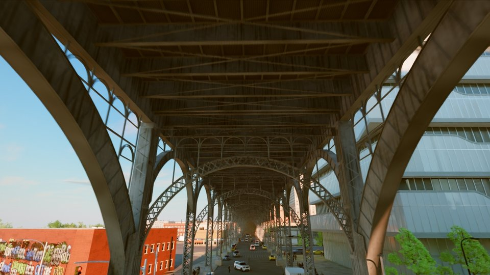

# Rendering in Blender Cycles

The web twin renders in real time. For the highest image quality, a shot can be exported to OpenUSD and path traced
in Blender Cycles with the same camera path, sun, buildings, trees, traffic and pedestrians. The export happens in
three steps:

1. **Harvest.** A script opens the client in a headless browser, plays the shot and saves the geometry, materials,
   textures, lights, the camera of every frame and every moving vehicle and pedestrian along the path.
2. **USD.** A Python script turns the harvest into USD layers that Blender, or any USD renderer, reads.
3. **Render.** Blender imports the USD, sets up the sky, lights and materials and renders frames with Cycles.

This guide takes one shot through all three steps, then shows the full take, the batch that renders many shots and
checks them, how to open the scene in Blender by hand, typical settings and times, and common problems. The commands
are written for a Linux shell; on Windows, run them in Git Bash. The same USD can be rendered with Unreal Engine 5
([Rendering in Unreal Engine 5](unreal.md)); [One city, three renderers](architecture.md) describes how the renderers
share the export.

## What you need

| Item | Requirement |
|---|---|
| Source checkout | the client installed with its tiles, models and textures: option B of the [quick start](quickstart.md), including Playwright's Chromium (`npx playwright install chromium`) |
| Blender | 4.5 LTS (tested with 4.5.14) |
| Python | 3.8 or later and [uv](https://docs.astral.sh/uv/), which fetches the USD library for the writer |
| GPU | an NVIDIA RTX GPU for OptiX; a 2560 × 1440 frame needed 12 to 17 GB of GPU memory and up to 31 GB of RAM. Other GPUs and CPUs work with `--cpu`, much more slowly |
| Disk | about 6 GB per shot for the harvest and the USD |
| Blender assets | the film-detail street trees and the window rooms from the dataset (below) |

## Install Blender 4.5 LTS

**Linux.** Download the official archive and unpack it anywhere; no installation or administrator rights are needed:

```bash
wget https://download.blender.org/release/Blender4.5/blender-4.5.14-linux-x64.tar.xz
tar xf blender-4.5.14-linux-x64.tar.xz
export BLENDER=$PWD/blender-4.5.14-linux-x64/blender
"$BLENDER" --version
```

**Windows.** Install Blender 4.5 LTS from <https://www.blender.org/download/lts/4-5/>, then in Git Bash:

```bash
export BLENDER="/c/Program Files/Blender Foundation/Blender 4.5/blender.exe"
"$BLENDER" --version
```

The first line of the answer should read `Blender 4.5.14 LTS` or another 4.5 release. Blender ships its own Python
with numpy and the USD library, so the render scripts need nothing else.

## Install the tools for the USD step

The USD writer runs in a normal Python with `usd-core`, `numpy`, `pillow` and `scipy`. With uv no environment needs
to be set up: `uv run --with ...` fetches the packages once and caches them.

```bash
pip install uv
uv run --no-project --with usd-core --with numpy --with pillow --with scipy python -c "import pxr; print('ok')"
```

## Download the Blender assets

The street trees of the offline render and the rooms seen through windows are in the dataset's `Blender/` folder.
`Blender/bxtrees2` is the tree set the writer uses by default: 51 trees of the 12 species forms the client plants
(London plane, honeylocust, pin oak, zelkova, Callery pear, littleleaf linden, maple, sophora, cherry, purple-leaf plum,
small ornamentals and ginkgo) in up to three sizes (young, mature, large) with up to two seeded variants each, with
branches to the twigs, leaves cut from CC0 scans and 62K to 1.37M triangles a tree. With the window rooms the download is 220 files, about 2.2 GB:

```bash
hf download mehmetkeremturkcan/valdrada --repo-type dataset --revision v0.3.1 \
    --include "Blender/bxtrees2/*" --include "Blender/bxwin/*" --local-dir .cache/hf
export BXTREES_ASSETS=$PWD/.cache/hf/Blender/bxtrees2
export BXTREES2_TEX=$BXTREES_ASSETS/tex
export WINROOMS=$PWD/.cache/hf/Blender/bxwin/rooms_atlas.png
```

Keep these variables set in every shell you use below. The first tree set, `Blender/bxtrees` (20 trees with leaf
cards), is still in the dataset: a USD written with `BXTREES_ASSETS` pointing to it renders with that set and needs
`BXTREES_TEX` set to its `tex` folder. Pedestrians are optional: they need the `basisu` command line
tool (version 1.60, from the [Basis Universal releases](https://github.com/BinomialLLC/basis_universal/releases)); set
`BASISU` to its path and `BX_PEDS_TEXCACHE` to an empty folder, or leave pedestrians out with `--nopeds` in all three
steps.

## Choose a shot

A shot is a camera path: an entry in `tools/ad/shots.json` with a time of day, a duration, a field of view and two or
more key points (longitude, latitude and height of the lens and of the point it looks at). `node tools/ad/shots.mjs`
prints the list. This guide uses `t7ArchSoffit`, a 3.6 s golden hour shot (108 frames at 30 fps) under the Riverside
Drive Viaduct where it crosses 125th Street at Twelfth Avenue; it is the lightest of the published shots.

To render a place of your own, add an entry to `shots.json` modelled on an existing one. Each key has
`"p": [lon, lat, height above the ground]` for the lens and `"look": [lon, lat, height]` for the target; the path
runs through the keys as a smooth curve.

## Capture the shot

The harvest starts the client on a local port, plays the shot the way the film recorder does, and saves everything
within 350 m of the camera path, with a coarse version of the city out to 4 km. It renders, so it needs the GPU.

```bash
mkdir -p ~/bx
node client/tools/ar34/export/harvest.mjs --shots t7ArchSoffit --frames 54 --out ~/bx/h
```

`--frames` names the key frames that also get a complete snapshot of the moving vehicles; the camera and the moving
vehicles are saved for every frame regardless. On a machine with several GPUs, `GPU_LANE=n` picks GPU (n − 1)
(see `tools/gpulock.mjs`).

What you should see: the log reports the page booting, the static world along the path (for this shot 1,840 meshes
and 126 pools of instanced objects with 121K instances), the window facades, the pedestrians of every frame, and
ends with `done in 1032.5s; 3645 blobs`. The run took 17 minutes and left 2.5 GB in `~/bx/h`.

## Write the USD

```bash
uv run --no-project --with usd-core --with numpy --with pillow --with scipy \
    python client/tools/ar34/export/usd_write.py --in ~/bx/h --out ~/bx/u --coplanar warn
```

The writer converts materials to `UsdPreviewSurface`, stores every mesh once and instances it, and writes the take's
root layer `~/bx/u/t7ArchSoffit.usda` with the camera, the moving layer, the static city, the trees, the materials and
the lights as sublayers, plus `textures/`. The trees are the prototypes of `BXTREES_ASSETS` on the client's tree
matrices: each instance takes its size from its pool and its own scale and its variant from a hash, at full detail
within 400 m of the lens path and with a lighter level of detail to 800 m. The trees' geometry layer is about 1.2 GB a
shot. `usd_trees.py --retake <usd dir>/<shot>.usda --out <dir>` swaps the trees of a USD already written in about 10 s.

The client's road graph joins some elevated roads to the street by ramps that its traffic follows but its road builder
does not deck, such as the Henry Hudson Parkway's ramps by West 125th Street, so the harvest has vehicles driving
through the air there. The writer's ramp hook (`usd_ramps.py`) lays a deck under every such path, asphalt on top,
concrete on its sides and underside and 1 m parapets along its edges, so that no vehicle is drawn without a surface
under it; the client itself still draws these ramps without a deck. Its coplanar pass separates surfaces that lie in one plane (paint on asphalt,
signs on walls), which a path tracer would otherwise show as flickering stripes. Pairs it cannot resolve are listed in
`bx_fix.json`; with `--coplanar warn` they are reported, without it the writer exits with code 4 when any remain in
view. "unresolved reference" warnings in the log are normal. For this shot the writer needed 4 minutes without the
coplanar pass (`--coplanar off`, for a quick look only) and wrote 2.5 GB; the pass adds 6 to 14 minutes per shot
(9.3 minutes in all for this shot in the published batch).

## Render one frame

```bash
CUDA_VISIBLE_DEVICES=0 "$BLENDER" -b --factory-startup --python client/tools/ar34/export/blender_take.py -- \
    --usd ~/bx/u/t7ArchSoffit.usda --harvest ~/bx/h --outdir ~/bx/frames --frames 54 \
    --res 1280x720 --samples 24 --leaves 0.45 --leafgain 1.8 --winrooms "$WINROOMS"
```

`-b` runs Blender without its window and `--factory-startup` ignores your Blender preferences. Everything after `--`
goes to the script. `CUDA_VISIBLE_DEVICES` picks the GPU (the number `nvidia-smi` shows when
`CUDA_DEVICE_ORDER=PCI_BUS_ID` is also set); without it Cycles uses every GPU it finds. On Windows `set` the variable
before the command or prefix it in Git Bash as shown.

The script imports the USD, builds the moving vehicles as animated objects, adds the lights, the window rooms, the
tree crowns and the film look (haze, bloom, grading), and renders with the OptiX denoiser. The light is physical by
default (`--light phys`): the sun and the street and vehicle lamps at the client's own levels, the visible sky dome as
the only sky light, no fill lights, untrimmed albedos and a fixed exposure per time of day from
`client/tools/ar34/export/phys_light.json`, the table the Unreal renderer reads too, so the two renderers light a
take alike. `--light web` selects the earlier rig, calibrated against the web takes. It writes `~/bx/frames/frame_00054.jpg`, the run's settings and times in `take_54-54.json`, and the frame's
depth in `_depth/`. On an RTX 6000 Ada shared with another render, the setup took 127 s (import 23 s) and the frame
28 s; the whole command 158 s.



## Render the full take

```bash
CUDA_VISIBLE_DEVICES=0 "$BLENDER" -b --factory-startup --python client/tools/ar34/export/blender_take.py -- \
    --usd ~/bx/u/t7ArchSoffit.usda --harvest ~/bx/h --outdir ~/bx/frames \
    --res 2560x1440 --samples 24 --leaves 0.45 --leafgain 1.8 --winrooms "$WINROOMS"
ffmpeg -framerate 30 -i ~/bx/frames/frame_%05d.jpg -c:v libx264 -crf 16 -pix_fmt yuv420p ~/bx/t7ArchSoffit.mp4
```

Without `--frames` the whole take is rendered (frames 0 to 107). Blender keeps the scene between frames and updates
only what moves, so after the first frame each frame costs the scene update plus sampling. Frames that exist are kept;
`--overwrite` renders them again. The motion blur matches the web takes (half a frame, ending at the frame).

## Render many shots with checks

`client/tools/ar34/export/bx_render_all.mjs` runs harvest, USD and take for a list of shots, spreads the takes
over the GPUs, resumes after an interruption, and checks every take. Paths to Blender and to the work folders are
options or environment variables:

```bash
BLENDER="$BLENDER" node client/tools/ar34/export/bx_render_all.mjs --shots t7ArchSoffit --gpus 0 \
    --frames 0-23 --res 1280x720 --samples 16 --work ~/bx/batch --clips ~/bx/takes --nocut --uflags "--coplanar warn"
```

`--dry` prints the plan without running it. Each shot's stage, times and check results go to
`<work>/<shot>/status.json` and a summary to `<work>/summary.json`.

Two checks run before the take, so that a shot with a known fault stops early. Right after the USD is written, the
geometry check reads `bx_fix.json` and stops the shot (stage `usd-check`) when more than 100 coplanar pairs remain in
view (`--coplanartol`), when the USD was written without the coplanar pass, or when a harvest with walkers has no walker
file. The batch writes every USD with `--coplanar warn` and leaves the decision to this check. Then three preview
frames (the first, the middle and the last) are rendered at 8 samples (`--previewspp`) and compared with the web take
by the colour check below; a failing preview stops the shot (stage `preview-check`). `--nopreview` skips the preview.
The temporal and crown checks compare consecutive frames at the take's samples, so they run on the take only.
`--preps n` sets the number of harvest and USD workers (one per GPU by default); writing a USD is CPU work, so with the
harvests done a larger value writes several USDs at once.

The take of a shot fails when one of these checks fails:

| Check | What it measures | Fails when |
|---|---|---|
| Colour against the web take (`cyc_vs_web.py`) | per 16 px cell, the colour and lightness difference from the web take of the same shot after matching exposure | off-colour cells cover more than 0.4 % of the frame, or off-lightness cells more than 2 % |
| Temporal scan (`tools/ad/temporal_scan.py --fine`) | flicker, z-fighting and shimmer between neighbouring frames | 6 or more 40 px cells change over 6 levels in 8 or more frames, among other tests |
| Coplanar audit (`bx_fix.json`) | surface pairs in one plane that remain in view | more than 100 pairs |
| Crown check (`bx_leafcheck.py`) | flicker in tree crowns, using the take's own depth | 8 or more 32 px cells in 6 or more frames |

The colour check needs a web take of the same shot in `client/shots/ad/clips/<shot>/` (recorded with
`tools/ad/record.mjs`); without one it is skipped. After each take, `bx_temporal.py` averages each frame with its
neighbours by depth reprojection to remove residual noise and keeps the raw frames in `_raw/`; it is a filter, not a
check.

## Open the scene in Blender

**With the full setup.** Add `--blend ~/bx/scene.blend` to the single frame command above. The script saves the scene
after its setup, with sky, lights, materials, trees, windows, pedestrians and the film look, then renders. Open it with
`"$BLENDER" ~/bx/scene.blend`: the shot's camera is the scene camera, the frame range is the take's (0 to 107) and
Cycles is set to the command's resolution; pick a frame and press F12 to render it. For this shot the file was 3.2 GB
with 13,504 objects. Keep `~/bx/h` and `~/bx/u` in place: the scene refers to their files.

**As a plain import.** In Blender, choose File, Import, Universal Scene Description, and select
`~/bx/u/t7ArchSoffit.usda` with the default options. This imports the city, the materials and the animated camera,
but not what the setup scripts add: there is no sky, the camera must be made the scene camera (Scene properties),
the sun is weaker than in the render, and pedestrians, window rooms, leaf translucency, lamps and the film look are
missing. The import is useful to inspect geometry and materials.

## Settings and times

| Setting | Value used for the published takes | Option |
|---|---|---|
| Resolution | 2560 × 1440 | `--res` |
| Samples | 24 by day and at golden hour, 32 at dusk and night | `--samples` |
| Denoiser | OptiX on the GPU, OIDN on the CPU | `--denoiser` |
| Motion blur | half a frame, ending at the frame | `--mblur`, `--mbpos` |
| Output | JPEG quality 95, `frame_%05d.jpg` | `--quality` |

Measured on RTX 6000 Ada GPUs (48 GB) with two Blender processes per GPU, over the 20 published takes: the setup took
about 72 s, the first frame 23 to 51 s, and each further frame a median of 9.4 s at golden hour and 11.4 s at night
or dusk, of which about 4.7 s is the scene update. A 108 frame take took 16 to 35 minutes. The harvest took 15 to
26 minutes per shot and the USD step 9 to 19 minutes. These takes used the first tree set and the web-matched light;
with physical light and bxtrees2, a golden hour take of `t7ArchTrack` needed 91 s of setup (31 s for the USD import)
and about 8.5 s a frame.

## Common problems

| Problem | Fix |
|---|---|
| `CUDA out of memory` or OptiX errors | Render on an idle GPU (`nvidia-smi`), one Blender process per GPU, or lower `--res`. |
| One render uses every GPU | Set `CUDA_VISIBLE_DEVICES` (and `CUDA_DEVICE_ORDER=PCI_BUS_ID`). |
| No NVIDIA GPU | Add `--cpu` (and `--threads N`); expect minutes per frame. |
| The writer stops with `COPLANAR FAIL` and exit code 4 | Run it with `--coplanar warn`; the pairs are listed in `bx_fix.json`. Do not use `--coplanar off`, which brings back flickering paint and decals. |
| Facades or paving in wrong colours | The USD was written into a folder that holds textures of another harvest. Write each USD into a new folder. |
| Trees look like the web version | `BXTREES_ASSETS` was not set when the USD was written. |
| Tree crowns render black or fail in the log | `BXTREES2_TEX` does not point to `Blender/bxtrees2/tex` (`BXTREES_TEX` and `Blender/bxtrees/tex` for the first set). |
| Facades show plain glass instead of rooms | `--winrooms` does not point to `rooms_atlas.png`. |
| Night frames are nearly dark | The lights step found no harvest: pass `--harvest` with the harvest folder. |
| A setup step fails | Each step reports `hook <name> ... failed` in the log and the render goes on without it. Search the log for `hook`; `--nopeds` leaves pedestrians out. |
| Black fans on the road or dark triangles at junctions | Coincident surfaces: keep the default `--ground drop` and the coplanar pass. |
| The harvest stops after 45 minutes | Its time limit: raise it with `HARNESS_MAX_MIN=90`. |
