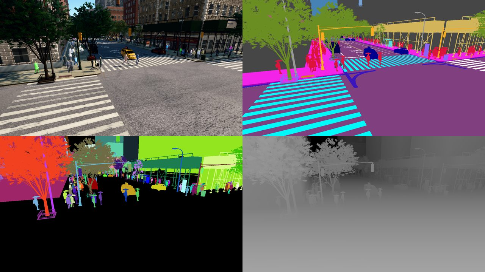
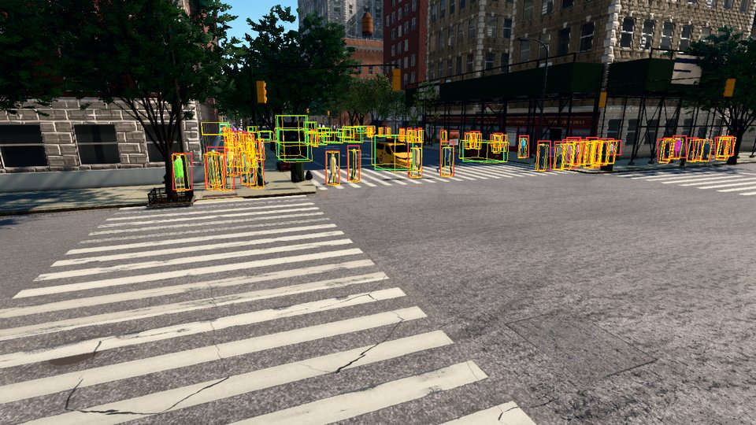
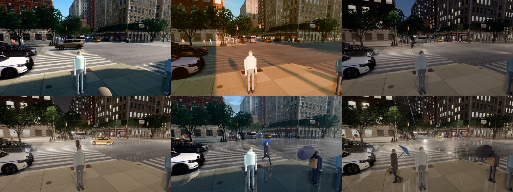

# Data collection

This guide shows how to collect images and ground truth with the Python API: placing and moving cameras, RGB, depth,
semantic and instance segmentation, 2D and 3D bounding boxes in COCO and KITTI format, vehicles and pedestrians under
your control, time of day and weather, and recording sequences whose annotations stay consistent from frame to frame.
Each section explains one script in `PythonAPI/examples/data_collection/`; every script is complete, runs on its own
and cleans up after itself.

## Before you start

Start a server (see the [quick start](quickstart.md)) with the procedural pedestrians. The photoreal pedestrians
contain MetaHuman-derived components whose licence does not allow building datasets or training and testing models with
them ([licensing](licensing.md)):

```
BoundlessNYC.exe --pedestrians procedural
```

On Linux, add `--pedestrians procedural` to the server command of the [installation guide](install.md). Then
install the package with numpy and run a script from the top of the checkout or the release folder:

```bash
pip install -e PythonAPI numpy          # or the wheel in PythonAPI/dist/
python PythonAPI/examples/data_collection/sensor_suite.py
```

Every script takes `--host` and `--port` for the server and `--out` for its output folder (default
`_out/<name>`). The run times below were measured on an RTX 6000 Ada at 1280 × 720.

| Script | Shows | Output | Time |
|---|---|---|---|
| `first_frame.py` | the shortest complete capture | one RGB image, its labels | 4 s |
| `camera_path.py` | placing a camera, a scripted camera path | a still, 60 path frames, their poses | 39 s |
| `sensor_suite.py` | RGB, depth, semantic and instance segmentation, masks | images, masks, labels | 8 s |
| `boxes_coco_kitti.py` | 2D and 3D boxes of vehicles and pedestrians | COCO and KITTI files, previews | 33 s |
| `actors_control.py` | spawning, driving and removing vehicles and pedestrians | chase camera frames | 149 s |
| `weather_time.py` | time of day and rain | six images | 185 s |
| `record_sequence.py` | a synchronized sequence with track ids | 100 frames of four sensors, poses, tracks | 118 s |

## How a capture works

The scripts put the world in **synchronous mode**: the simulation advances by a fixed step (0.05 s, 20 steps per
simulated second) each time the client calls `world.tick()`, and waits otherwise. A camera that `listen`s delivers
its data for a step before that `tick()` returns, so after the call all data of the step are in hand, and they all
share its frame number.

The city **streams around the spectator** (`world.get_spectator()`): tiles, buildings and traffic load near it.
Move the spectator to the place you want to capture, call `world.wait_until_loaded()`, and keep the spectator near
your cameras when they move far.

**Coordinates** are metres east (x), north (y) and up (z) from 40.7831 N, 73.9712 W. `map.geolocation_to_location(lat,
lon)` converts a latitude and longitude; it returns height 0, and the ground at W 120th St and Amsterdam Ave is about
3.4 m higher, which `map.get_junctions(...)[0].location` includes. A rotation is pitch, yaw and roll in degrees,
yaw counter-clockwise from east; a camera looks along its own x axis. Manhattan's avenues run uptown at a yaw of
about 61°. Offsets of attached actors are in the parent's frame: x forward, y left, z up.

Actors stay in the world until they are destroyed, also after the client disconnects. The scripts destroy what they
spawn and restore the settings they change in a `finally` block.

## Placing and moving the camera

A camera spawned without `attach_to` stands at a world pose; `set_transform` moves it. A small helper turns an eye
point and a target point into a pose:

```python
def look_at(eye, target):
    d = target - eye
    return Transform(eye, Rotation(pitch=math.degrees(math.atan2(d.z, math.hypot(d.x, d.y))),
                                   yaw=math.degrees(math.atan2(d.y, d.x))))

placed = look_at(at(-20, 14.5, 1.7), at(0, 0, 1.5))     # eye height on the west sidewalk, facing the junction
camera = world.spawn_actor(bp, placed)
```

`camera_path.py` writes a still from that pose, then flies a scripted path: key frames of eye and target points,
eased between them, one step per frame. Each step moves the camera and the spectator together and ticks once:

```python
pose = look_at(e0 + (e1 - e0) * u, g0 + (g1 - g0) * u)
camera.set_transform(pose)
spectator.set_transform(pose)          # keep the streaming centre with the camera
frame = world.tick()
```

It writes `placed.png`, `path/000000.png` to `path/000059.png` and `poses.json`, which holds each frame's camera
transform and its 3 × 3 intrinsic matrix `K`. To ride along with a vehicle instead, spawn the camera with
`attach_to=vehicle` and an offset such as `Transform(Location(-7, 0, 3), Rotation(pitch=-10))` (7 m behind, 3 m up);
`actors_control.py` does this.

## RGB, depth and segmentation

`sensor_suite.py` spawns four cameras at one pose with one field of view: `sensor.camera.rgb`,
`sensor.camera.depth`, `sensor.camera.semantic_segmentation` and `sensor.camera.instance_segmentation`. Cameras that
share pose, field of view and image size are rendered from the same view, so their outputs align pixel for pixel.

| File | Content |
|---|---|
| `rgb.png` | 8-bit RGB through the full rendering pipeline (shadows, anti-aliasing, bloom, grading) |
| `depth.pfm` | 32-bit float metres along the view axis, exact; sky is 1000 m. `depth.to_numpy()` gives the array |
| `depth_mm.png` | 16-bit millimetres, clipped at 65.535 m |
| `semantic_ids.png` | one class id per pixel (8-bit); `classes.json` lists the 36 classes with names and colours (Cityscapes colours where the class exists there) |
| `semantic_color.png` | the same in the class colours |
| `instance.png`, `instance.json` | the instance code of every pixel (24-bit RGB, lossless) and the labels of every object in view |
| `masks/class_<name>.png` | one binary mask per class, from the semantic ids |
| `masks/<id>_<class>.png` | one binary mask per vehicle and pedestrian, from the instance ids |

The masks take one comparison each:

```python
ids = sem.to_numpy()                                   # (H, W) class ids
road = ids == by_name["road"]
inst_ids = inst.instance_ids()                          # (H, W) instance ids; 0 is background
for label in inst.labels:
    if label.class_name in ("car", "bus", "truck", "pedestrian"):
        mask = inst_ids == label.id
```

A measured run at W 120th St and Amsterdam Ave labelled 140 objects and wrote masks for 88 vehicles and pedestrians.
Label cameras accept `image_size_x` and `image_size_y`; the RGB camera always renders at the server's `--res`.



## 2D and 3D boxes in COCO and KITTI format

The instance and bounding box cameras deliver one `ObjectLabel` per object in view:

| Field | Meaning |
|---|---|
| `id` | instance id, stable while the object exists |
| `class_name`, `class_id` | its semantic class |
| `bbox` | the visible box `[x, y, w, h]` in pixels, top-left origin |
| `amodal_bbox`, `occlusion` | the full box including occluded parts and the occluded fraction; measured for the largest objects, as many as the camera's `amodal` attribute asks for (each costs about 5 ms) |
| `truncated` | the object reaches the image border |
| `location`, `yaw`, `extent` | the bottom centre of its 3D box in the world, its heading, its half sizes (x along the heading); for vehicles, pedestrians and street furniture |
| `actor_id` | the actor id when the object was spawned through the API, else 0 |

`boxes_coco_kitti.py` films W 120th St and Amsterdam Ave from a camera about 3.6 m above the street, spawns four cars on autopilot and
saves five frames half a second apart. It writes the RGB images and three label sets:

```python
objects = boxes.filter(classes={"car", "bus", "truck", "pedestrian"}, min_area=40)
coco.add(f"../kitti/image_2/{name}.png", objects, rgb.width, rgb.height, frame=rgb.frame)   # util.CocoWriter
lines = [util.kitti_object(l, boxes.transform) for l in objects]                            # KITTI label_2 lines
calib = util.kitti_calib(rgb.width, rgb.height, rgb.fov)                                    # KITTI calib file
```

`coco/annotations.json` is a COCO detection file with the visible box; the amodal box, the occlusion and the instance
and actor ids are extra keys of each annotation. `kitti/label_2/<frame>.txt` has one line per object in KITTI's
format: type, truncated, occluded, alpha, the 2D box, height, width and length, the bottom centre in camera coordinates
(x right, y down, z forward) and `rotation_y`; `kitti/calib/<frame>.txt` holds the projection matrices. A measured
line:

```
Car 0.00 1 1.16 634 229 705 288 2.33 2.03 4.73 1.26 -3.45 28.75 1.20
```

Three conventions to know: `occluded` is 0, 1 or 2 from the measured occlusion (below 0.1, below 0.5, above) and
3 when it was not measured; `truncated` is 0 or 1; and standing pedestrians carry no heading, so their `rotation_y`
is 0. KITTI assumes a level camera; for a pitched camera the heading is measured in the camera's x-z plane. The types
are `Car`, `Bus`, `Truck` and `Pedestrian`; pass `types=` to `kitti_object` for others. The previews in `preview/`
draw the visible boxes and the 3D boxes, which `util.label_vertices` gives as eight world points and
`util.project_point` projects into the image.



## Vehicles and pedestrians

Blueprints name what can be spawned: `lib.filter("vehicle.*")` lists 23 vehicle kinds (taxis, private cars, vans,
trucks, MTA buses, police, ambulance and fire trucks), `lib.filter("walker.pedestrian.*")` the pedestrians (a single
`walker.pedestrian.procedural` with `--pedestrians procedural`), and `controller.ai.walker` the route planner for a
pedestrian. `actors_control.py` shows each kind of control:

```python
car = world.spawn_actor(lib.find("vehicle.taxi2"), spawn_point)       # spawn points are lane centres
car.apply_control(VehicleControl(throttle=0.6))                       # direct control until changed
car.apply_control(VehicleControl(brake=1.0))
car.set_autopilot(True, route=["left"])                               # the traffic simulation drives; turn left next
car.get_obstacle_ahead(max_distance=40)                               # nearest road user in its path, or None

walker = world.spawn_actor(random.choice(walker_bps), Transform(corner))
ai = world.spawn_actor(lib.find("controller.ai.walker"), Transform(), attach_to=walker)
ai.start()
ai.go_to_location(target)                                             # along sidewalks and crosswalks
manual.apply_control(WalkerControl(direction=heading, speed=1.2))     # a pedestrian under direct control
```

Vehicles on autopilot keep to their lanes, stop at signals and follow traffic; `world.get_traffic_light_state(yaw)`
reports the signal for a direction of travel. The background traffic (620 vehicles and 520 pedestrians around the
spectator by default) never counts API actors; `world.set_ambient_traffic(vehicles=0, walkers=0)` empties the streets
for a controlled scenario (`--empty`), and the script restores the previous numbers. Destroy sensors and controllers
before the actors they are attached to.

A measured run printed (positions in metres):

```
spawned Vehicle(id=135, type_id='vehicle.taxi2') at Location(x=995.108, y=2877.671, z=3.387) box half sizes Vector3D(x=2.445, y=1.115, z=0.870)
after 2 s of throttle: 3.4 m/s, obstacle ahead: None
after braking: 0.0 m/s
signal for uptown traffic: TrafficLightState(red, 9.9 s left, north_south)
on autopilot: Location(x=992.349, y=2893.673, z=3.387), heading -119 deg
walker route: 16 points, state walking
after 6 s: routed walker walking at Location(x=992.777, y=2911.331, z=3.521), manual walker at Location(x=995.406, y=2910.394, z=3.520)
destroyed 5 actors
```

The chase frames are in `chase/`, one per simulated second.

## Time of day and weather

`world.set_weather` sets the time of day (`day`, `golden`, `dusk`, `night`) and rain from 0 (dry) to 1 (downpour,
wet streets). Presets: `WeatherParameters.Day`, `.Golden`, `.Dusk`, `.Night`, `.RainyDay`, `.RainyNight`.

```python
world.set_weather(WeatherParameters("night", rain=0.8))
for _ in range(60):          # 3 simulated seconds: lighting, wet streets and the image history settle
    world.tick()
```

`weather_time.py` saves one image per condition. Streets stay wet for a few simulated seconds after the rain stops,
so the script ticks 200 more steps after restoring the weather.



## Recording a sequence

`record_sequence.py` mounts four cameras (RGB, depth, semantic and instance) at one pose on a car driving on
autopilot and records every step. The loop checks that all four delivered the step's frame before writing anything:

```python
rig.clear()
frame = world.tick()
if sorted(rig) != sorted(SENSORS) or any(d.frame != frame for d in rig.values()):
    incomplete += 1          # never expected in synchronous mode: skip the frame
    continue
```

An object keeps its instance id while it exists, so the ids are track ids: the script collects the frames of every
id in `tracks.json` and writes them into `coco.json` as `instance_id`. `poses.jsonl` holds, per frame, the car's
transform and speed and the camera's transform and intrinsics, so 3D labels can be moved into the camera or the
vehicle frame. The car carrying the rig is left out of the tracks.

A measured run printed:

```
frame 1233: 22 objects, car at 2.0 m/s
frame 1253: 18 objects, car at 3.9 m/s
frame 1273: 19 objects, car at 5.7 m/s
frame 1293: 20 objects, car at 7.5 m/s
frame 1313: 19 objects, car at 8.8 m/s
100 frames written (0 incomplete), 34 tracks, 17 of them in at least half of the frames, 1978 boxes in coco.json
```

The 100 frames took 528 MB on disk. At 20 Hz, a recording of `--frames 1200` covers one simulated minute.

## Speed

The cameras dominate the cost of a step. At 1280 × 720 on the RTX 6000 Ada, `world.last_tick["timing"]` reported
93 ms for the step itself and 757 ms for the label pass of one instance segmentation camera. Cameras with one pose share one render, so four aligned cameras cost much less than four separate
poses. `PythonAPI/examples/benchmark.py` measures the common setups on your machine.

For the full API see the [Python API reference](api/python_api.md); the [tutorials](tutorials/index.md) cover the
same ground step by step.
