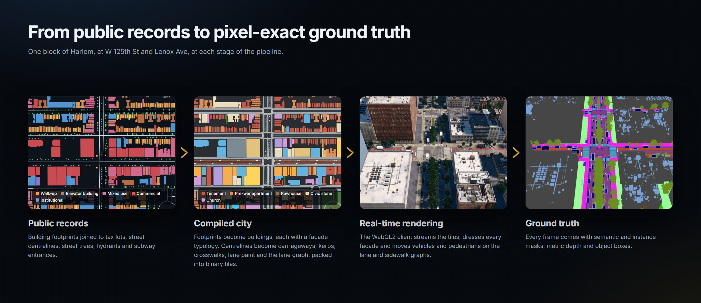
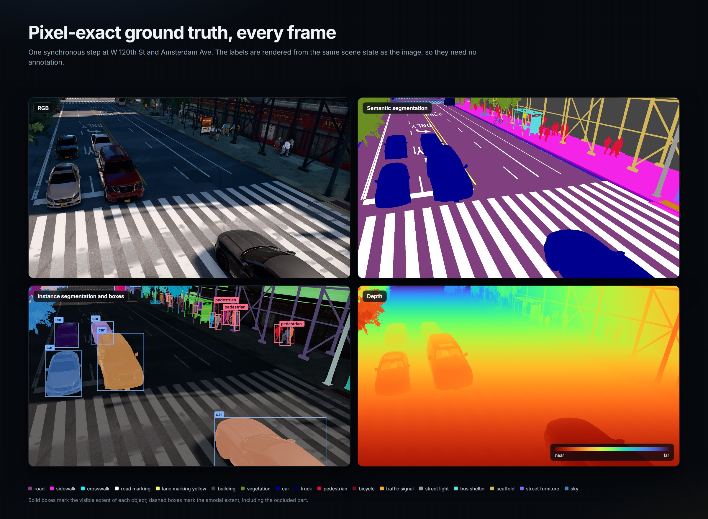
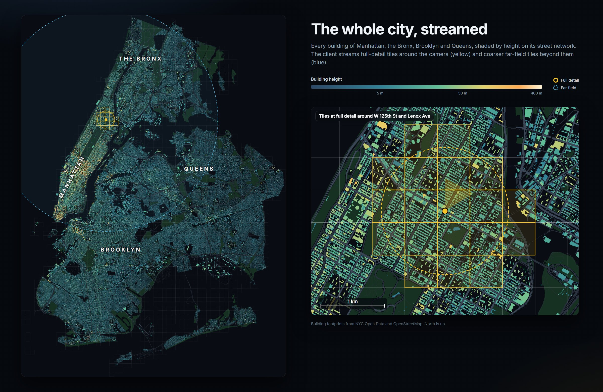
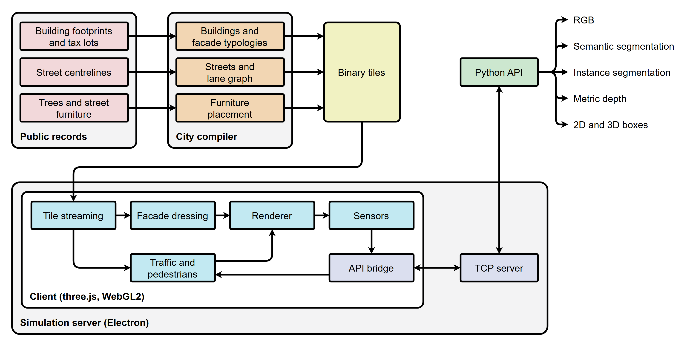

# BoundlessNYC { .visually-hidden }

{ .hero }

<p class="lead">BoundlessNYC is a city-scale digital twin of New York City compiled from public municipal records. It
renders Manhattan, the Bronx, Brooklyn and Queens in real time, simulates traffic and pedestrians on the city's own
street network, and returns pixel-exact ground truth through a Python API modelled on CARLA.</p>

[Get started](api/getting_started.md){ .md-button .md-button--primary }
[Tutorials](tutorials/index.md){ .md-button }
[Python API](api/python_api.md){ .md-button }
[Download for Windows](https://github.com/mkturkcan/boundless-nyc/releases){ .md-button }
[Demo in the browser](https://huggingface.co/spaces/mehmetkeremturkcan/boundless-nyc){ .md-button }
[Compiled city](https://huggingface.co/datasets/mehmetkeremturkcan/boundless-nyc){ .md-button }

## How it works

<figure markdown="span">
  
</figure>

Every element of the city traces back to a record. Building footprints come from NYC Building Footprints and are
joined to the tax-lot database (PLUTO) for floors, use and year of construction, and to the facade inspection filings
for the wall material. Each building is classified into a facade typology and dressed procedurally: windows on the
recorded floor count, cornices, storefronts, fire escapes, stoops and rooftop equipment. Streets come from the city's
centreline database with their recorded widths, lane counts, directions and speed limits. They become carriageways,
kerbs, crosswalks, lane paint, bus lanes, and the lane and sidewalk graphs that traffic and pedestrians move on.

The compiler is a Node.js pipeline and the renderer is three.js on WebGL2, so nothing needs an engine build. Changing
how the city looks or behaves is an edit to a JavaScript module and a page reload, and the whole city can be
recompiled from the public records ([Building from source](building.md)).

## Ground truth for every frame

<figure markdown="span">
  
</figure>

Each synchronous step can return RGB, semantic segmentation in Cityscapes-compatible classes, instance segmentation
with visible and amodal boxes, occlusion ratios and 3D poses, and metric depth. The labels are rendered from the same
scene state as the image, so they need no annotation. The Python package writes COCO detection files directly, and the
[tutorials](tutorials/index.md) go from a first connection to a recorded dataset.

## The whole city, streamed

<figure markdown="span">
  
</figure>

The compiled city holds every building of the four boroughs. The client keeps full detail around the camera and draws
coarser far-field tiles beyond it, so any street of the four boroughs can be rendered on a laptop GPU.

## Architecture

<figure markdown="span">
  
</figure>

The compiler turns the public records into binary tiles. The client streams the tiles around the camera, dresses the
facades, simulates traffic and pedestrians, and renders each frame with its ground truth. The same client runs in two
hosts. In a browser, as on the Hugging Face Space, it is an interactive explorer. Inside the simulation server, an
Electron application, it advances one fixed step per request and sends sensor data over TCP to the Python API
([wire protocol](api/protocol.md)).

## Gallery

<figure markdown="span">
  
</figure>

## Citation

```bibtex
@article{turkcan2024boundless,
  title   = {Boundless: Generating photorealistic synthetic data for object detection in urban streetscapes},
  author  = {Turkcan, Mehmet Kerem and Li, Yuyang and Zang, Chengbo and Ghaderi, Javad and Zussman, Gil and Kostic, Zoran},
  journal = {arXiv preprint arXiv:2409.03022},
  year    = {2024}
}
```
