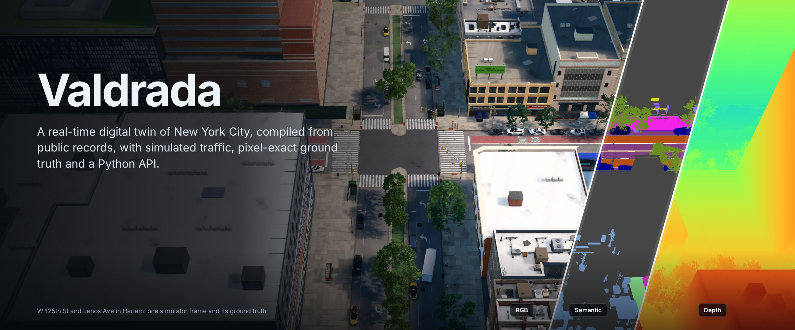
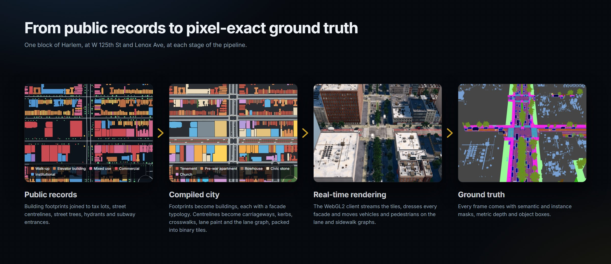
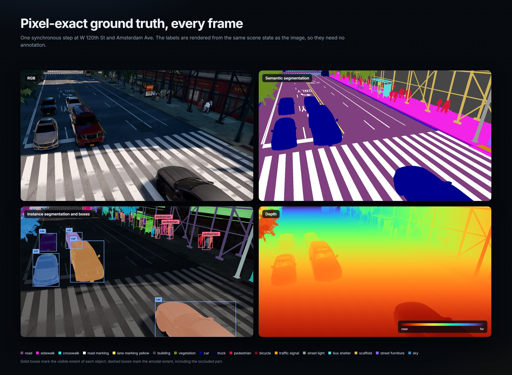
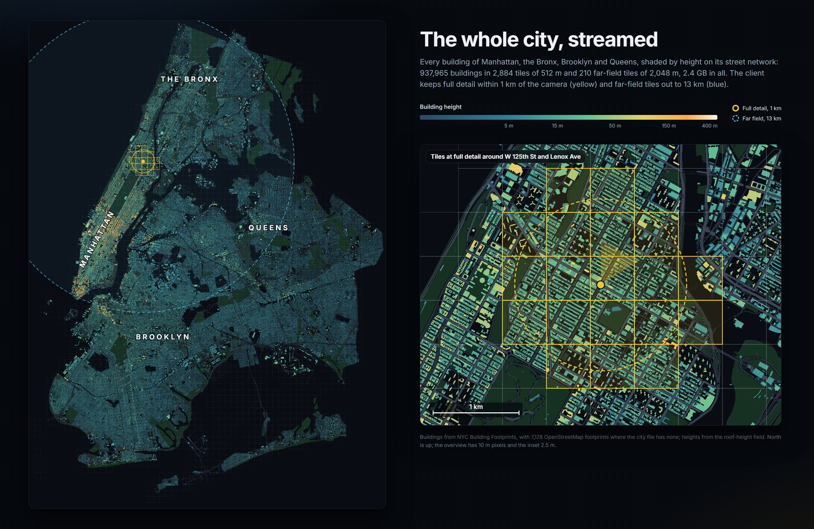
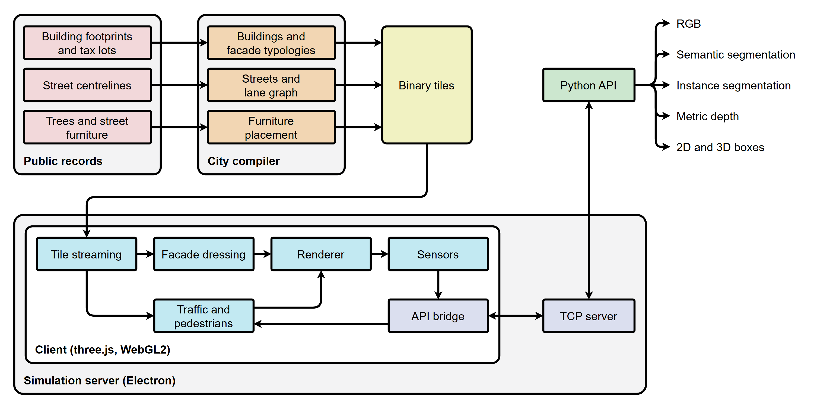
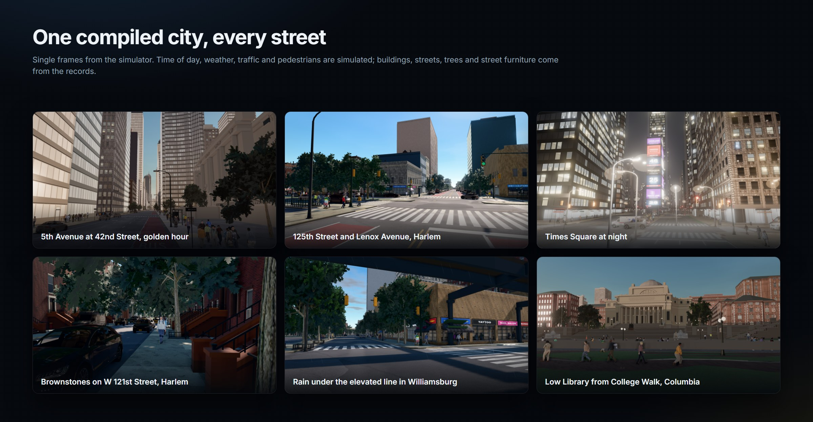

# Valdrada { .visually-hidden }

{ .hero }

<p class="lead">Valdrada is a city-scale digital twin of New York City
compiled from public municipal records. It
renders Manhattan, the Bronx, Brooklyn and Queens in real time, simulates traffic and pedestrians on the city's own
street network, and returns pixel-exact ground truth through a Python API modelled on CARLA.</p>

[Quick start](quickstart.md){ .md-button .md-button--primary }
[Tutorials](tutorials/index.md){ .md-button }
[Python API](api/python_api.md){ .md-button }
[Download for Windows](https://github.com/mkturkcan/valdrada/releases){ .md-button }
[Demo in the browser](https://huggingface.co/spaces/mehmetkeremturkcan/valdrada){ .md-button }
[Compiled city](https://huggingface.co/datasets/mehmetkeremturkcan/valdrada){ .md-button }

## How it works

<figure markdown="span">
  
</figure>

Every element of the city traces back to a record. Building footprints come from NYC Building Footprints and are
joined to the tax-lot database (PLUTO) for floors, use and year of construction, and to the facade inspection filings
for the wall material. Each building is classified into a facade typology and dressed procedurally: windows on the
recorded floor count, cornices, storefronts, fire escapes, stoops and rooftop equipment. Streets come from the city's
centreline database with their recorded widths, lane counts, directions and speed limits. They become carriageways,
kerbs, crosswalks, lane paint, bus lanes, and the lane and sidewalk graphs that traffic and pedestrians move on.

The compiler is a Node.js pipeline and the renderer is three.js on WebGL2, so nothing needs an engine build. Changing
how the city looks or behaves is an edit to a JavaScript module and a page reload, and the whole city can be
recompiled from the public records ([Building from source](building.md)).

## Ground truth for every frame

<figure markdown="span">
  
</figure>

Each synchronous step can return RGB, semantic segmentation in Cityscapes-compatible classes, instance segmentation
with visible and amodal boxes, occlusion ratios and 3D poses, and metric depth. The labels are rendered from the same
scene state as the image, so they need no annotation. The Python package writes COCO detection files directly, and the
[tutorials](tutorials/index.md) go from a first connection to a recorded dataset.

## The whole city, streamed

<figure markdown="span">
  
</figure>

The compiled city holds every building of the four boroughs. The client keeps full detail around the camera and draws
coarser far-field tiles beyond it, so any street of the four boroughs can be rendered on a laptop GPU.

## Areas modelled in detail

Some areas go beyond the compiled records. On 125th Street, from Twelfth Avenue to the Harlem River, every frontage is
built from a per-building specification (storeys, bays, materials, storefronts and signs) with a facade kit and a
library of 35 CC0 material sets; the street surface, furniture and street life are laid out along the corridor. The
Riverside Drive viaduct follows its published 1900 design, and the Manhattan Valley viaduct, the 1 train's 125th Street
station, the Park Avenue Viaduct and the bridge approaches at the Harlem River are modelled to their documented
dimensions, with the 1 train and Metro-North running on them. In Central Park, the relief comes from USGS 3DEP and the
water bodies, paths and landmarks from OpenStreetMap; tree crowns are segmented by watershed on a vegetation index from
NAIP near-infrared imagery, and the resulting 16,951 trees are assigned to 33 species groups fitted to the park's
published composition.

## Offline rendering

A recorded take can be exported to OpenUSD and rendered in Blender Cycles or Unreal Engine 5.
`boundlessjs/tools/ar34/export/harvest.mjs` boots the page as the film recorder does and writes every visible mesh,
instance set and camera sample of the take; `usd_write.py` turns this into USD layers. `blender_take.py` renders the
frames in Cycles with the web client's materials rebuilt as node groups, baked facade windows with interiors,
film-detail street trees and physical light; `ue_take.py` renders the same USD with Unreal's Lumen and Movie Render
Queue, with master materials per family, CC0 layered materials, Nanite foliage and a cinematic preset.
[One city, three renderers](architecture.md) describes the design, and the guides for
[Blender Cycles](blender-cycles.md) and [Unreal Engine 5](unreal.md) take one shot through each renderer.

## Architecture

<figure markdown="span">
  
</figure>

The compiler turns the public records into binary tiles. The client streams the tiles around the camera, dresses the
facades, simulates traffic and pedestrians, and renders each frame with its ground truth. The same client runs in two
hosts. In a browser, as on the Hugging Face Space, it is an interactive explorer. Inside the simulation server, an
Electron application, it advances one fixed step per request and sends sensor data over TCP to the Python API
([wire protocol](api/protocol.md)).

## Gallery

<figure markdown="span">
  
</figure>

## Citation

Valdrada is developed and maintained by Mehmet Kerem Turkcan. If you use
Valdrada, the compiled city or imagery rendered with it, please cite Valdrada itself:

```bibtex
@software{turkcan2026valdrada,
  author  = {Turkcan, Mehmet Kerem},
  title   = {{Valdrada}: a real-data, real-time digital twin of New York City},
  year    = {2026},
  version = {0.3.1},
  url     = {https://github.com/mkturkcan/valdrada}
}
```
