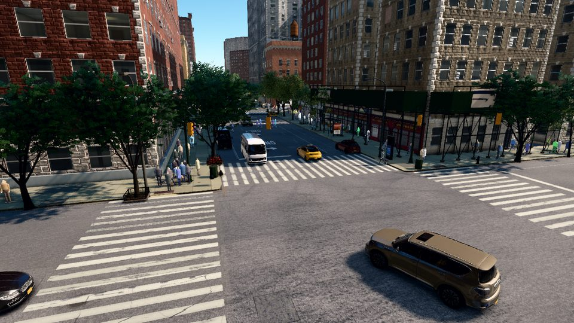

# Quick start

Valdrada runs as a simulation server. The server renders the city and simulates its traffic, and your Python code
drives it over TCP (port 2000): it moves cameras, spawns vehicles and pedestrians, steps the world and receives
images and labels. This page gets a first frame on disk. Option A uses the published release, option B a source
checkout. The [installation guide](install.md) covers requirements, servers without a display and common errors.

## Option A: the release

### Windows

The release archive contains the server, the compiled city (`Content/`) and the Python package.

1. Download `Valdrada-0.3.1-win64.zip` (about 2 GB) from the
   [releases page](https://github.com/mkturkcan/valdrada/releases) and extract it.
2. In the extracted folder `Valdrada_0.3.1_win64`, double-click `StartServer.bat`. A window opens; on the first
   start the city appears after one to two minutes, while the shaders compile. `StartServer_Headless.bat` starts the
   same server without a window.
3. Open a terminal in that folder and install the Python package:

    ```
    pip install PythonAPI\dist\valdrada-0.1.0-py3-none-any.whl numpy
    ```

4. Save the example at the end of this page as `first_frame.py` and run it with `python first_frame.py`.

### Linux

The release has no Linux executable. The same server runs from a source checkout on the Electron runtime that npm
installs, with the release's `Content/` from the dataset (3.9 GB):

```bash
git clone https://github.com/mkturkcan/valdrada.git
cd valdrada
(cd server && npm install)
pip install -U "huggingface_hub>=1.0"
hf download mehmetkeremturkcan/valdrada --repo-type dataset --revision v0.3.1 --include "Content/*" --local-dir .
cd server
env -u ELECTRON_RUN_AS_NODE npx electron . --content ../Content
```

In a desktop session this opens the server window. On a machine without a display, start it headless instead:

```bash
env -u ELECTRON_RUN_AS_NODE npx electron . --content ../Content --headless \
    --ozone-platform=headless --use-angle=vulkan --enable-features=Vulkan
```

The server prints `listening on 127.0.0.1:2000` at once and `world ready` when the city has loaded. Then, in a second
terminal at the top of the checkout:

```bash
pip install -e PythonAPI numpy
python PythonAPI/examples/data_collection/first_frame.py
```

## Option B: from source

A source checkout runs the client in a Vite development server and the simulation server on top of it. It needs
Node.js 22.12 or later. The tiles, models and textures (3.8 GB) come from the dataset. On Windows, run these commands
in Git Bash.

```bash
git clone https://github.com/mkturkcan/valdrada.git
cd valdrada
npm install
(cd client && npm install)
(cd server && npm install)
pip install -U "huggingface_hub>=1.0"
hf download mehmetkeremturkcan/valdrada --repo-type dataset --revision v0.3.1 \
    --include "Content/tiles/*" --include "Content/models/*" --include "Content/textures/*" --local-dir .cache/hf
mv .cache/hf/Content/tiles .cache/hf/Content/models .cache/hf/Content/textures client/public/
```

Start the client and the server, each in its own terminal:

```bash
cd client && npm run dev        # the client on http://127.0.0.1:5219; open it in a browser to look around
cd server && npm run dev             # the simulation server on port 2000, showing that client
```

On a Linux machine without a display, start the server with
`env -u ELECTRON_RUN_AS_NODE npx electron . --dev-url=http://127.0.0.1:5219 --headless --ozone-platform=headless --use-angle=vulkan --enable-features=Vulkan`
in `server/`. Then install the package and run the example from a third terminal:

```bash
pip install -e PythonAPI numpy
python PythonAPI/examples/data_collection/first_frame.py
```

The compiler can also build the tiles from the city's public records instead of downloading them; see
[Building from source](building.md).

## Your first frame

The script below connects to the server, moves the spectator to W 120th St and Amsterdam Ave, waits until that part
of the city has streamed in, places an RGB camera and a bounding box camera at the same pose, and steps the world once.
Both cameras deliver their data for that step before `world.tick()` returns. The same script is
`PythonAPI/examples/data_collection/first_frame.py`.

```python
import valdrada
from valdrada import Location, Rotation, Transform

world = valdrada.Client("127.0.0.1", 2000).get_world()
spot = world.get_map().geolocation_to_location(40.80955, -73.95905)   # W 120th St and Amsterdam Ave
pose = Transform(spot + Location(-30, -30, 12), Rotation(pitch=-15, yaw=45))
world.get_spectator().set_transform(pose)                              # the city streams in around the spectator
world.wait_until_loaded()
lib = world.get_blueprint_library()
rgb, boxes = (world.spawn_actor(lib.find("sensor.camera." + kind), pose) for kind in ("rgb", "bounding_boxes"))
rgb.listen(lambda image: print(image.save_to_disk("_out/rgb.png")))
boxes.listen(lambda labels: print(labels.save_to_disk("_out/boxes.json"), len(labels.labels), "objects"))
world.tick()                                                           # one step: both files exist when it returns
rgb.destroy(), boxes.destroy()
```

It prints the two paths and the number of labelled objects. `_out/rgb.png` is a 1280 × 720 image of the
intersection; `_out/boxes.json` lists every object in view with its class, its visible box `[x, y, w, h]` in pixels
and, for vehicles, pedestrians and street furniture, its position and size in the world. With the default traffic a
run labelled 129 objects, 60 of them pedestrians.



Positions are metres east, north and up from 40.7831 N, 73.9712 W; rotations are degrees, with yaw counter-clockwise
from east. Next: the [data collection guide](data-collection.md) records depth, segmentation, 3D boxes and sequences,
and the [tutorials](tutorials/index.md) explain the API step by step.
