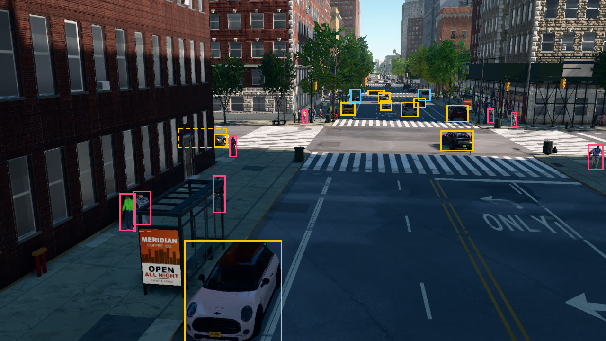
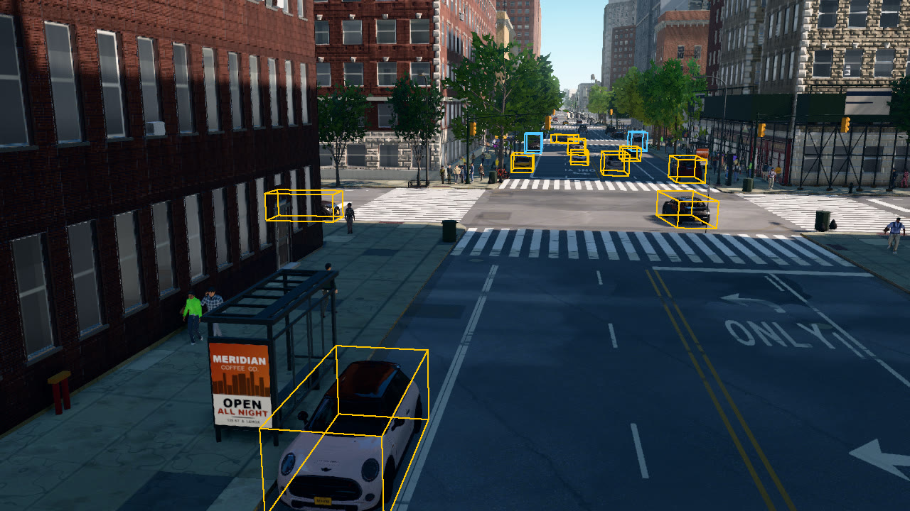

# Bounding boxes

This tutorial places an RGB camera and a bounding-box camera at one pose above Amsterdam Ave, looking north across
W 120th St. It draws the visible and amodal 2D boxes and the projected 3D boxes of the road users, and exports the
labels of the frame as JSON.

```
python PythonAPI/examples/tutorials/bounding_boxes.py
```

## The bounding-box camera

```python
bp = lib.find("sensor.camera.bounding_boxes")
bp.set_attribute("fov", 65)
bp.set_attribute("amodal", 48)        # amodal box and occlusion for the 48 largest objects
```

`sensor.camera.bounding_boxes` returns the labels of the instance segmentation camera without its image: one
`ObjectLabel` per object with at least `min_pixels` visible pixels (30 by default). By default each label has the
visible box only. With `amodal = N`, the N largest objects in view are also rendered alone, which gives their amodal
box, the extent of the whole object including the parts hidden behind others, and their occlusion, 1 minus the ratio
of visible to amodal area. The N largest objects are counted over all classes, and buildings and trees are often the
largest, so this script asks for 48. Each amodal object costs about 5 ms per capture.

## 2D boxes and occlusion

```python
users = boxes.filter(classes=ROAD_USERS, min_area=150)
...
rectangle(img2d, label.bbox, colour, width=3)
if label.amodal_bbox and (label.occlusion or 0) > 0.05:
    rectangle(img2d, label.amodal_bbox, colour, width=2, dash=8)      # the occluded extent, dashed
```

Boxes are `[x, y, w, h]` in pixels from the top-left corner. `bbox` bounds the visible pixels, `area` counts them, and
`truncated` marks a box that touches the image border. `filter` selects labels by class name, visible area and
whether they belong to an API actor (`actors_only=True`).

<figure markdown="span">
  
  <figcaption>Visible boxes (solid) and, for objects that are more than 5 % occluded, amodal boxes (dashed): cars in
  yellow, trucks and buses in blue, pedestrians in red.</figcaption>
</figure>

## 3D boxes

```python
def box_corners(label):
    c, e, yaw = label.location, label.extent, math.radians(label.yaw)
    fx, fy = math.cos(yaw), math.sin(yaw)
    return [Location(c.x + sx * e.x * fx - sy * e.y * fy, c.y + sx * e.x * fy + sy * e.y * fx, c.z + up * 2 * e.z)
            for sx in (-1, 1) for sy in (-1, 1) for up in (0, 1)]
...
pts = [project_point(p, boxes.transform, boxes.width, boxes.height, boxes.fov) for p in box_corners(label)]
```

Labels carry the object's pose in the world frame where it is known. `location` is the point on the ground below the
object's centre, `extent` holds its half sizes (x along its heading, y across it, z up) and `yaw` its heading in
degrees, counter-clockwise from east. Vehicles have all three; pedestrians have `location` and `extent` but no
heading, trees and street furniture a `location` only, and buildings none of them. `boundless.util.project_point`
projects a world point into the camera that captured the labels, whose pose is the event's `transform`, and returns
the pixel coordinates and the depth, or `None` behind the camera.

<figure markdown="span">
  
  <figcaption>The 3D boxes of the vehicles, projected into the image.</figcaption>
</figure>

## Per-frame JSON

```python
boxes.save_to_disk(os.path.join(a.out, "labels.json"))          # every labelled object of the frame
```

`save_to_disk` writes `to_dict()`: the frame number, the timestamp, the image size, the field of view, the sensor's
world pose, the renderer's description of the camera (with the intrinsics `K`) and one entry per object. One entry of
the file this run wrote:

```json
--8<-- "docs/assets/tutorials/boxes_label.json"
```

The script prints the road users in view, largest first:

```text
--8<-- "docs/assets/tutorials/bounding_boxes.txt"
```

## The complete script

```python
--8<-- "PythonAPI/examples/tutorials/bounding_boxes.py"
```
