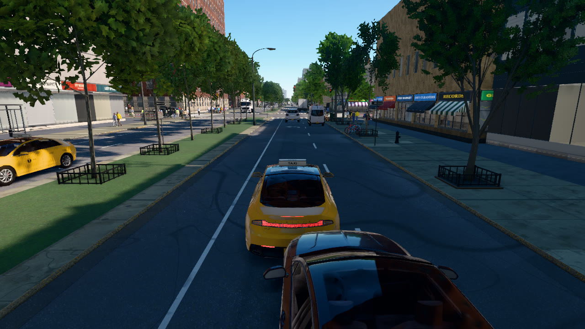
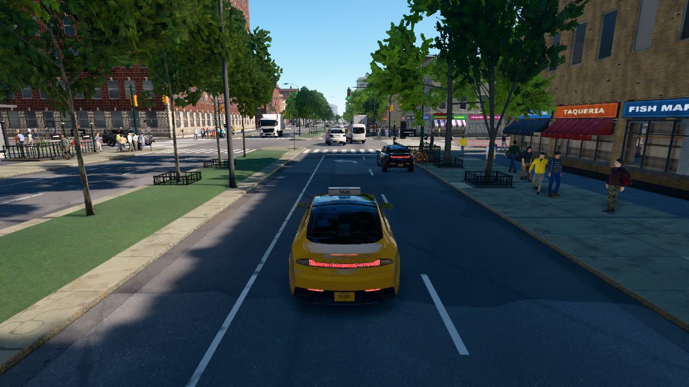
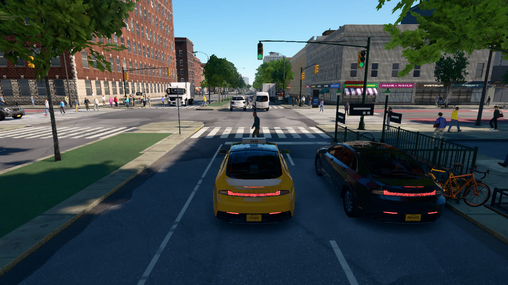
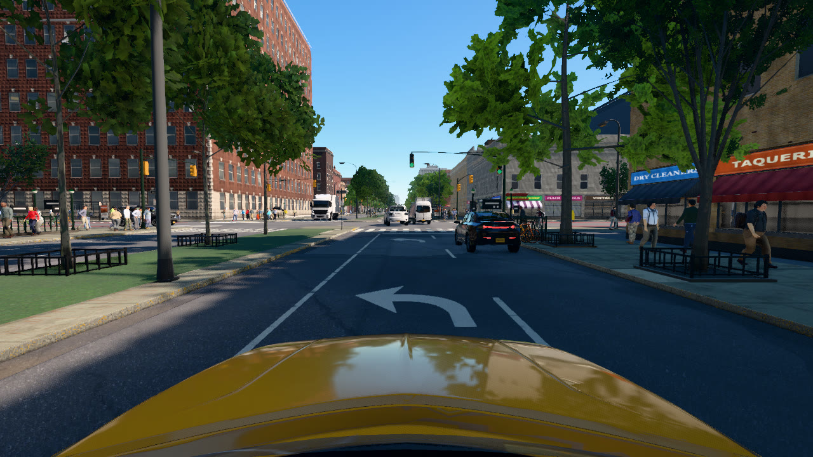

# Cameras

This tutorial spawns a taxi on Lenox Ave, hands it to the traffic simulation, attaches a chase camera and a dashcam,
and saves one frame per simulated second from each camera while the taxi drives north through W 125th St.

```
python PythonAPI/examples/tutorials/cameras.py [--seconds 12] [--every 20]
```

## Spawning a vehicle

```python
while True:
    light = world.get_traffic_light_state(UPTOWN)
    if light.state == "green" and light.time_left > 12.0:
        break
    world.tick()
...
start = m.get_waypoint(here - up * 60.0 + right * 5.0, heading=UPTOWN)
taxi = world.spawn_actor(lib.find("vehicle.taxi2"), start.transform)
taxi.set_autopilot(True, route=["straight", "straight"])     # the traffic simulation drives it
```

Every signal in the city runs the same cycle. `get_traffic_light_state(yaw)` returns the state of the signals for
traffic travelling at that heading and the time left in it, and the script steps the world until a green phase for
uptown traffic has just begun, so that the taxi reaches W 125th St while the light is green. It also thins the city's
background traffic with `world.set_ambient_traffic(vehicles=200)`, so that no queue blocks the lane, and restores the
previous amount when it exits.

`get_waypoint` snaps a location to the nearest lane of the loaded street network and returns a `Waypoint` with the
lane's pose, width and speed limit; `heading` selects the direction of travel. Lenox Ave has a median, so the query
point lies 5 m east of the centre line, over the northbound carriageway, 60 m south of the junction. A waypoint's
transform is a valid spawn pose; `spawn_actor` sets vehicles and walkers on the ground under the location it is given.

A spawned vehicle is under manual control until `set_autopilot(True)`. On autopilot the traffic simulation drives it:
it follows its lane, keeps its distance to the vehicle ahead, stops for red lights and yields to pedestrians. `route`
lists the turns to take at the next junctions, here straight on twice. The blueprint library holds the vehicle kinds
of the NYC fleet (`lib.filter("vehicle.*")`).

## Attaching cameras

```python
rigs = {
    "chase": (Transform(Location(-7.0, 0.0, 3.0), Rotation(pitch=-12)), 90),
    "dashcam": (Transform(Location(0.9, 0.0, 1.55), Rotation(pitch=-3)), 100),
}
...
cam = world.spawn_actor(bp, offset, attach_to=taxi)
frames[name] = queue.Queue()
cam.listen(frames[name].put)
```

With `attach_to`, a camera's transform is an offset in its parent's frame (x forward, y left, z up) and the camera
follows the parent. The chase camera sits 7 m behind the taxi and 3 m above the road, pitched down by 12°; the dashcam
sits behind the windscreen with a wider field of view. `fov` is the horizontal field of view in degrees. RGB cameras
render at the server's resolution (`--res`).

## Saving frames

```python
frame = world.tick()
images = {name: q.get(timeout=30) for name, q in frames.items()}   # one image per camera per tick
...
image.save_to_disk(os.path.join(a.out, name, f"{frame:06d}.png"))
```

Each listening camera delivers one image per step before `tick()` returns, so one image per camera is waiting in its
queue after every tick. `save_to_disk` writes a PNG and creates the folders it needs; `to_numpy()` returns the image as
an H × W × 4 array instead.

The first RGB camera that listens is the primary view: its image is the frame the server renders for the step, and the
server window shows it. Every further camera pose costs one more rendered frame per step. Cameras at the same pose
share one capture, which the following tutorials use.

<div class="tgrid" markdown>
<figure markdown="span">
  
  <figcaption>Chase camera at the start, t = 0 s.</figcaption>
</figure>
<figure markdown="span">
  
  <figcaption>Chase camera at t = 5 s, approaching W 125th St.</figcaption>
</figure>
<figure markdown="span">
  
  <figcaption>Chase camera at t = 11 s, past W 125th St.</figcaption>
</figure>
<figure markdown="span">
  
  <figcaption>Dashcam at t = 5 s.</figcaption>
</figure>
</div>

The script prints:

```text
--8<-- "docs/assets/tutorials/cameras.txt"
```

## The complete script

```python
--8<-- "PythonAPI/examples/tutorials/cameras.py"
```
