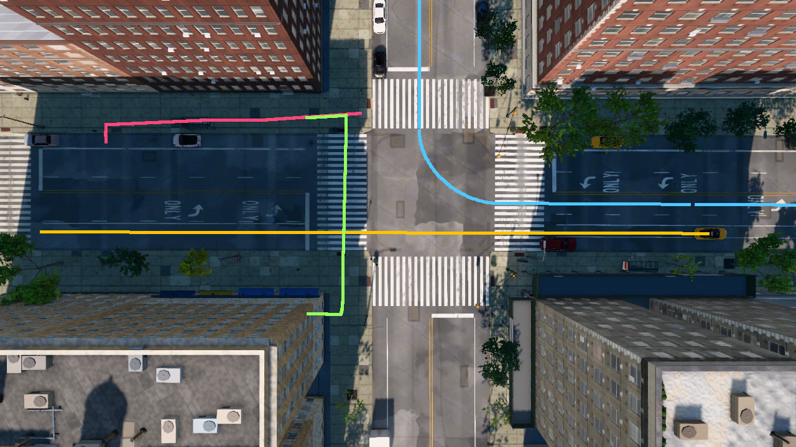

# Controlling actors

This tutorial empties W 120th St and Amsterdam Ave of the city's own traffic and controls four actors: a taxi under
manual control that stops for the light, a car on autopilot with a planned left turn, a pedestrian steered along a
sidewalk route, and a pedestrian sent across the junction by the AI controller. A camera looks straight down on the
junction, and the script draws every actor's path over its last frame before it destroys the actors.

```
python PythonAPI/examples/tutorials/actors.py [--seconds 30]
```

## The ambient population

```python
original, ambient = world.get_settings(), world.get_ambient_traffic()
world.set_ambient_traffic(vehicles=0, walkers=0)        # API actors only; they are never counted or removed
```

The city keeps a background population of vehicles and pedestrians around the spectator. `set_ambient_traffic` sets
its size; 0 empties the streets for a controlled scenario. Actors spawned through the API are never counted in it or
removed by it. The script restores the previous sizes when it exits. Before it spawns anything, it steps the world
until the signals on W 120th St have just turned green: every signal runs the same cycle, so the taxi on the avenue
will meet a red light and the SUV on the street will turn on green.

## Manual control and autopilot

```python
manual = spawn("vehicle.taxi2", m.get_waypoint(J.location - up * 55 + east * 4, heading=UPTOWN).transform)
auto = spawn("vehicle.suv", m.get_waypoint(J.location - east * 45, heading=UPTOWN - 90).transform)
auto.set_autopilot(True, route=["left"])            # at the next junction, turn left (uptown)
```

A spawned vehicle is under manual control until `set_autopilot(True)`. The taxi starts 55 m south of the junction on
a northbound lane of Amsterdam Ave, the SUV 45 m west of it on W 120th St, heading east. On autopilot the SUV follows
its lane and the signals and turns left, uptown, at the junction. The simulation takes the next planned turn at a
junction that offers it; at one that does not, the vehicle chooses its own way and keeps the plan for later.

```python
t = taxi.get_transform()
ahead = (junction.location - t.location).dot(unit(t.rotation.yaw))      # metres to the junction centre
target = cruise
if 11.0 < ahead < 35.0 and world.get_traffic_light_state(t.rotation.yaw).state != "green":
    target = 0.0 if ahead < 13.0 else min(cruise, math.sqrt(2.0 * 2.0 * (ahead - 13.0)))
if target == 0.0:
    return VehicleControl(brake=1.0)
error = target - taxi.get_speed()
if error >= 0:
    return VehicleControl(throttle=min(1.0, 0.3 + 0.3 * error))
return VehicleControl(brake=min(1.0, 0.5 - 0.3 * error))
```

A manually controlled vehicle moves only by `apply_control(VehicleControl(throttle, steer, brake, hand_brake,
reverse))`, applied until the next call; it obeys no signals by itself. The controller above holds 7 m/s and, while
the light for its heading is not green, brakes to a stop at the stop line. `get_traffic_light_state(yaw)` returns the
signal state for traffic travelling at that heading and the time left in it. `steer` is between -1 and 1, positive to
the right; the taxi drives straight and does not use it.

## Direct control and the AI walker controller

```python
_, sidewalk = m.plan_walk_route(J.location - up * 45 - east * 12.5, J.location + up * 30 - east * 12.5)
walker = spawn("walker.pedestrian.0003", Transform(sidewalk[0]))
...
walker.apply_control(WalkerControl(direction=sidewalk[0] - here_w, speed=0.0 if arrived else 1.4))
```

`plan_walk_route` returns the length and the points of a route over the sidewalks and crosswalks. The first pedestrian
walks up the west sidewalk of Amsterdam Ave under direct control: on every step the script points its
`WalkerControl` at the next point of the route, with the direction as a world-frame vector and the speed in m/s.

```python
crosser = spawn("walker.pedestrian.0011", Transform(J.location - up * 14 + east * 14))
ai = world.spawn_actor(lib.find("controller.ai.walker"), Transform(), attach_to=crosser)
ai.start()
route = ai.go_to_location(J.location + up * 14 - east * 14)   # the opposite corner, over two crosswalks
```

The second pedestrian gets a `controller.ai.walker`, attached to it like a sensor. `go_to_location` plans a route and
starts walking it; at each crossing the pedestrian waits at the kerb until the walk signal leaves enough time to cross
and no car is in the way. `get_state()` reports `walking` and then `arrived`.

## Destroying actors

```python
for actor in reversed(actors):
    actor.destroy()
```

Actors stay in the world until they are destroyed, also after the client that spawned them disconnects. Destroying an
actor also destroys the sensors and controllers attached to it. The script destroys everything it spawned in a
`finally` block, so an interrupted run leaves nothing behind.

<figure markdown="span">
  
  <figcaption>The last top-down frame, 30 s into the run, with the paths of the manually driven taxi (yellow), the
  autopilot SUV (blue), the pedestrian under direct control (red) and the pedestrian routed by the AI controller
  (green). Amsterdam Ave runs from left to right, uptown to the right; W 120th St runs from top to bottom, west at the
  top.</figcaption>
</figure>

The script prints:

```text
--8<-- "docs/assets/tutorials/actors.txt"
```

## The complete script

```python
--8<-- "PythonAPI/examples/tutorials/actors.py"
```
