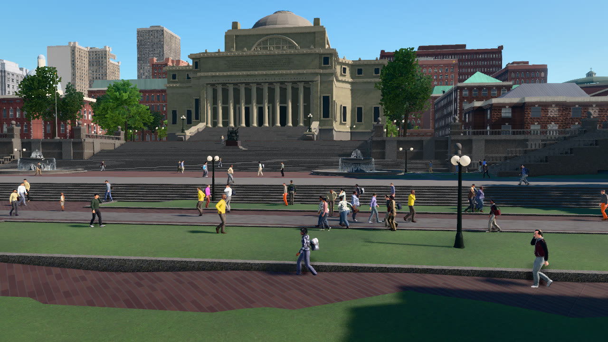
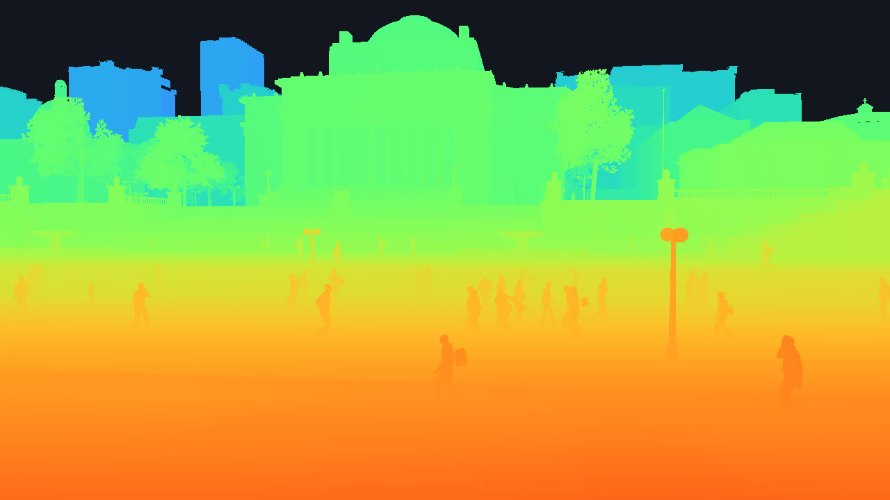

# Depth

This tutorial places an RGB camera and a depth camera at one pose on Columbia's College Walk, facing Low Library. It
saves the metric depth exactly and as a 16-bit PNG, writes a colour-mapped preview, and back-projects the depth into a
coloured point cloud in the world frame.

```
python PythonAPI/examples/tutorials/depth.py
```

## Metric depth

```python
depth.save_to_disk(os.path.join(a.out, "depth.npy"))     # float32 metres along the view axis
depth.save_to_disk(os.path.join(a.out, "depth.png"))     # uint16 millimetres; 65.535 m and beyond saturate
d = depth.to_numpy()
sky = d >= depth.depth_max                               # no geometry along the ray
```

A `DepthImage` holds one `float32` per pixel: the distance in metres from the camera plane along the view axis (the
camera-frame x coordinate, often called z-depth), not the distance along the ray. Pixels where the ray meets no
geometry, the sky, hold `depth.depth_max`. `save_to_disk` chooses the format by extension: `.npy` and `.pfm` keep the
floats exactly, and `.png` writes 16-bit millimetres, which covers 0 to 65.535 m and saturates beyond. Keep the `.npy`
(or `.pfm`) file when the far field matters.

## A colour-mapped preview

```python
near, far = 2.0, depth.depth_max
x = (np.log(np.clip(d, near, far)) - math.log(near)) / (math.log(far) - math.log(near))
vis = turbo(1.0 - 0.9 * x)                               # near is red, far is blue
vis[sky] = (18, 22, 30)
```

Depth in a street scene spans several orders of magnitude, so the preview maps the logarithm of the depth, from 2 m
to `depth_max`, to the Turbo colour map and paints the sky dark.

<div class="tgrid" markdown>
<figure markdown="span">
  
  <figcaption>RGB.</figcaption>
</figure>
<figure markdown="span">
  
  <figcaption>Depth on a log scale from 2 m (red) to 1000 m (blue); the sky is dark.</figcaption>
</figure>
</div>

## Back-projection

```python
f = depth.width / (2.0 * math.tan(math.radians(depth.fov) / 2.0))          # focal length in pixels
# camera frame: x forward (the view axis), y left, z up; image right is -y and image down is -z
x = d[keep]
y = -(u[keep] + 0.5 - depth.width / 2.0) * x / f
z = -(v[keep] + 0.5 - depth.height / 2.0) * x / f
R = np.array(depth.transform.rotation.matrix())                             # body -> world
```

The cameras are ideal pinholes: the principal point is the image centre and the focal length follows from the
horizontal field of view, as `boundless.util.camera_intrinsics(width, height, fov)` returns it. A pixel's depth and its
offset from the principal point give the point in the camera frame, and the sensor's world pose, which every event
carries in `transform`, takes it to the world frame. The script writes every second pixel's point with its RGB colour
to `points.ply`, a binary PLY file that point-cloud viewers open, and repeats the computation for the centre pixel with
`Transform.transform_point`.

The script prints:

```text
--8<-- "docs/assets/tutorials/depth.txt"
```

## The complete script

```python
--8<-- "PythonAPI/examples/tutorials/depth.py"
```
