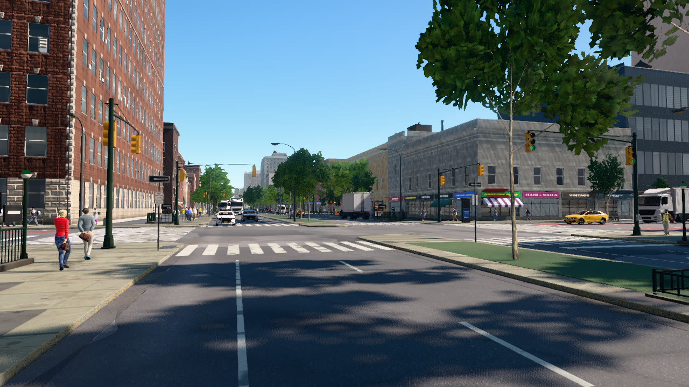
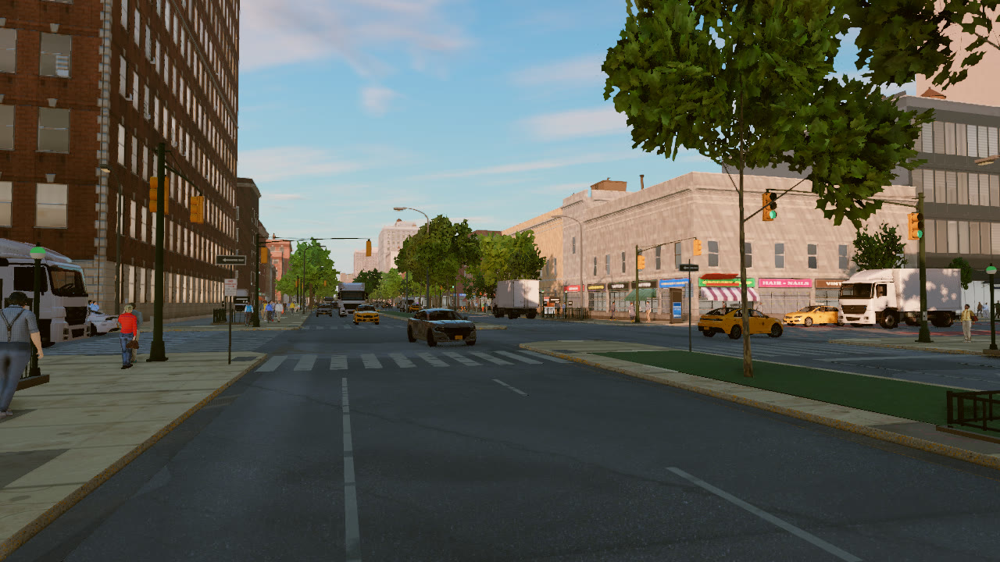
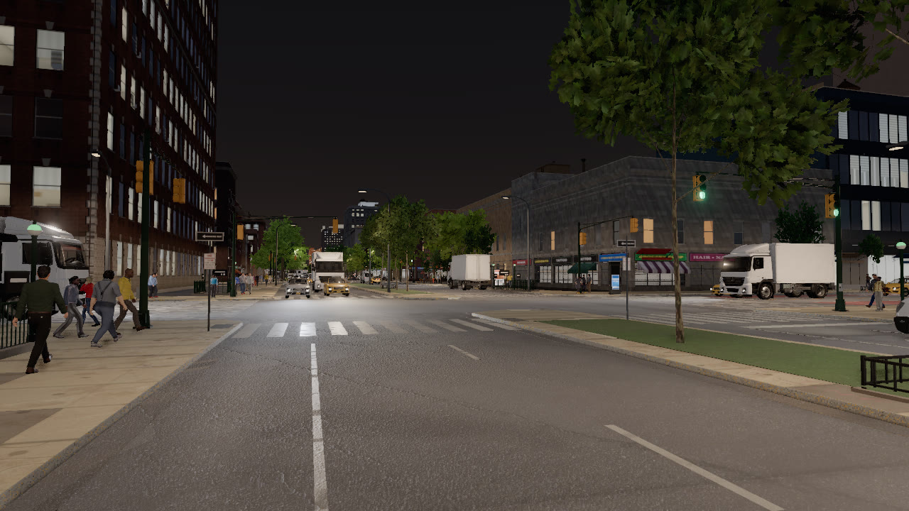
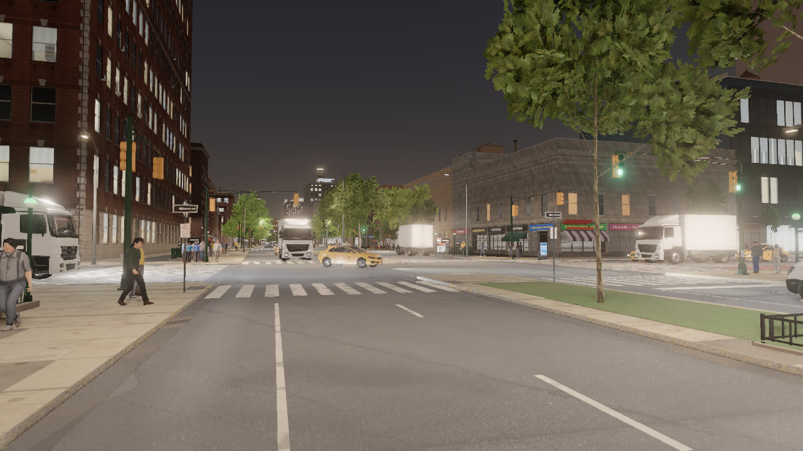
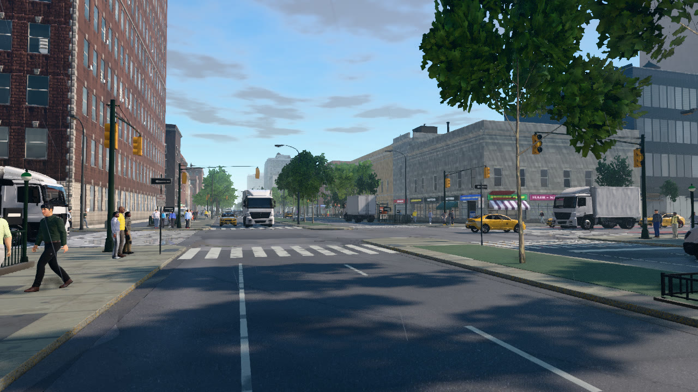

# First steps

This tutorial connects to the server, moves the spectator to W 125th St and Lenox Ave in Harlem, steps the world in
synchronous mode, and renders one view at four times of day and in rain.

```
python PythonAPI/examples/tutorials/first_steps.py
```

## Connect

```python
client = boundless.Client(a.host, a.port)       # retries until the server accepts the connection
client.set_timeout(120.0)
world = client.get_world()                       # waits until the simulator has booted
```

`Client` retries until the server accepts the connection, and `get_world()` waits until the simulator has booted,
which takes a minute or two on the first start while the shaders compile. `set_timeout` bounds how long each call
waits for its answer.

## Synchronous stepping

```python
original = world.get_settings()
world.apply_settings(boundless.WorldSettings(synchronous_mode=True, fixed_delta_seconds=0.05))
```

In synchronous mode, the default, the simulation advances by `fixed_delta_seconds` on each `world.tick()` and waits
otherwise, so a script can take as long as it needs between steps. `tick()` returns the new frame number once every
listening sensor has delivered its data for that step. The script restores the original settings before it exits.

## The spectator and streaming

```python
here = m.geolocation_to_location(*LENOX_125)
world.get_spectator().set_transform(Transform(here + Location(0, 0, 30)))
print("loaded:", world.wait_until_loaded())
junction = m.get_junctions(center=here, radius=40)[0]
```

The city streams in around the spectator, and renders and map queries see only what has loaded. `wait_until_loaded`
renders with time frozen until the tiles and buildings around the spectator are in. `get_junctions` then returns the
intersection from the loaded street network, with its location, its arms and whether it is signalized.

## A camera, the time of day and the weather

```python
camera = world.spawn_actor(bp, Transform(junction.location + Location(-22, -20, 1.8), Rotation(pitch=2, yaw=45)))
latest = {}
camera.listen(lambda image: latest.update(image=image))   # runs once per tick, before tick() returns
```

A camera spawned without a parent keeps its world pose. This one stands at eye height on the south-west corner of the
intersection and looks up Lenox Ave with a horizontal field of view of 80°. `listen` registers a callback that
receives the camera's image on every step.

`world.set_weather` takes a time of day (`day`, `golden`, `dusk` or `night`) and an amount of rain between 0 and 1;
the presets of `WeatherParameters` combine the two. After each change the script runs 60 steps (3 s of simulated
time) so that the lighting and the renderer's temporal history settle, then saves the last image. Rain wets the
streets gradually, and they dry the same way once it stops, so the script restores the weather it found and runs
another 200 steps before it exits; the next script then starts on dry streets.

<div class="tgrid" markdown>
<figure markdown="span">
  
  <figcaption>WeatherParameters.Day.</figcaption>
</figure>
<figure markdown="span">
  
  <figcaption>WeatherParameters.Golden.</figcaption>
</figure>
<figure markdown="span">
  
  <figcaption>WeatherParameters.Dusk.</figcaption>
</figure>
<figure markdown="span">
  
  <figcaption>WeatherParameters.Night.</figcaption>
</figure>
</div>

<figure markdown="span">
  
  <figcaption>WeatherParameters.RainyDay: daylight with rain 0.8.</figcaption>
</figure>

The script prints:

```text
--8<-- "docs/assets/tutorials/first_steps.txt"
```

## The complete script

```python
--8<-- "PythonAPI/examples/tutorials/first_steps.py"
```
