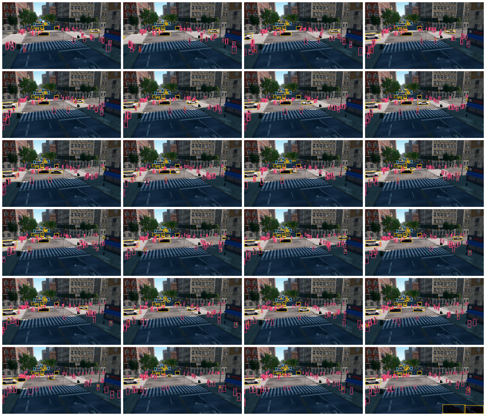

# Recording a dataset

This tutorial fills W 120th St and Amsterdam Ave with autopilot vehicles and walking pedestrians and records them with
a pole camera rig: synchronized RGB, semantic segmentation, instance segmentation with labels, and depth, once per
simulated second. It writes a COCO detection file for the road users and a contact sheet of the recorded frames.

```
python PythonAPI/examples/tutorials/record_dataset.py [--frames 24] [--every 20] [--vehicles 20] [--walkers 40]
```

## Traffic and pedestrians

```python
spawn_points = m.get_spawn_points(center=junction.location, radius=120, spacing=16)
...
v = world.try_spawn_actor(rng.choice(vehicle_bps), sp)
if v is not None:
    v.set_autopilot(True)
...
ai = world.spawn_actor(lib.find("controller.ai.walker"), Transform(), attach_to=w)
ai.start()
ai.set_max_speed(rng.uniform(1.1, 1.6))
ai.go_to_location(rng.choice(corners))
```

`get_spawn_points` returns poses on lane centres within a radius, spaced along each lane and facing the direction of
travel; `try_spawn_actor` returns `None` instead of raising when a spawn fails. The pedestrians start at the corners of
the junction, and an AI controller walks each of them to another corner over the sidewalks and crosswalks, waiting at
the kerb for a walk signal long enough to cross. The script sends a pedestrian that has arrived to a new corner. The
city's own ambient traffic stays on, so the frames contain both the actors spawned here and the background population;
labels tell them apart by `actor_id`. The script runs 6 s of simulation before it records, so that the traffic spreads
out.

## A synchronized rig

```python
for kind in ("rgb", "semantic_segmentation", "instance_segmentation", "depth"):
    bp = lib.find("sensor.camera." + kind)
    bp.set_attribute("fov", 70)
    bp.set_attribute("sensor_tick", a.every * DT)
    if kind == "instance_segmentation":
        bp.set_attribute("amodal", 8)
    cam = world.spawn_actor(bp, pose)
```

The four cameras share one pose, so each capture renders the view once and derives every output from the same scene
state. `sensor_tick` sets the simulated time between captures: with 1 s the rig captures on every twentieth step and
adds nothing to the steps in between, while the simulation keeps its 0.05 s step. After each `tick()` the rig's
events for that step have arrived, or none have when the rig was not due; the script checks the RGB queue and asserts
that the four outputs carry the same frame number.

## Output

```python
rgb.save_to_disk(os.path.join(a.out, "rgb", name + ".png"))
sem.save_to_disk(os.path.join(a.out, "semantic", name + ".png"))
inst.save_to_disk(os.path.join(a.out, "instance", name + ".png"))     # + instance/<frame>.json
depth.save_to_disk(os.path.join(a.out, "depth", name + ".png"))
users = inst.filter(classes=ROAD_USERS, min_area=100)
coco.add(f"rgb/{name}.png", users, rgb.width, rgb.height, frame=frame)
```

Every recorded frame is named by its frame number:

```
_out/record_dataset/
  rgb/<frame>.png                 RGB
  semantic/<frame>.png            class palette (save with colorize=False for raw class ids)
  instance/<frame>.png            instance codes (InstanceSegmentationImage.instance_ids decodes them)
  instance/<frame>.json           the frame's labels: boxes, occlusion, 3D poses, actor ids, camera intrinsics
  depth/<frame>.png               depth in millimetres, 16 bit
  annotations_coco.json           COCO detection file for car, bus, truck, bicycle and pedestrian
  contact_sheet.png
```

`boundless.util.CocoWriter` collects the labels frame by frame into one COCO detection file. Its `bbox` is the visible
box; the amodal box, the occlusion, the instance id and the actor id ride along as extra keys of each annotation, and
the instance id stays with an object from frame to frame. The categories are the semantic classes passed to the
writer, here the road users. An excerpt of the file:

```json
--8<-- "docs/assets/tutorials/dataset_coco_excerpt.json"
```

<figure markdown="span">
  
  <figcaption>The recorded frames at quarter size with the COCO boxes: cars in yellow, trucks and buses in blue,
  pedestrians in red.</figcaption>
</figure>

The script prints:

```text
--8<-- "docs/assets/tutorials/record_dataset.txt"
```

## The complete script

```python
--8<-- "PythonAPI/examples/tutorials/record_dataset.py"
```
