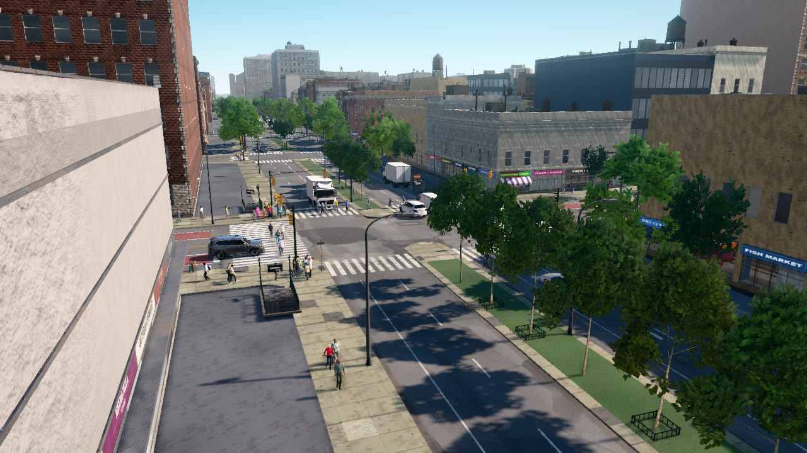
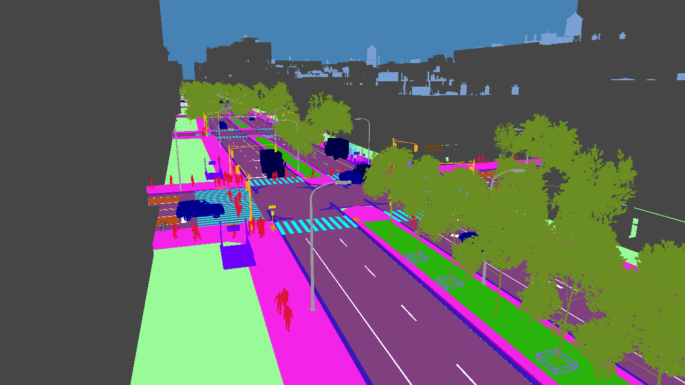
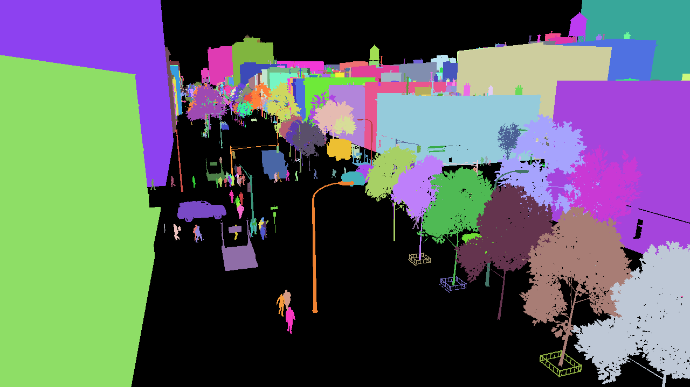

# Semantic and instance segmentation

This tutorial places an RGB camera, a semantic segmentation camera and an instance segmentation camera at one pose,
16 m above the west side of Lenox Ave south of W 125th St, looking up the avenue. It saves the class mask in its
palette and as raw class ids, the instance codes with the labels of every object in view, and a view with one colour
per object.

```
python PythonAPI/examples/tutorials/segmentation.py
```

## Label cameras

```python
pose = Transform(junction.location + Location(-45, -40, 16), Rotation(pitch=-14, yaw=42))
for kind in ("rgb", "semantic_segmentation", "instance_segmentation"):
    bp = lib.find("sensor.camera." + kind)
    bp.set_attribute("fov", 75)
    cam = world.spawn_actor(bp, pose)
    cam.listen(lambda data, kind=kind: latest.__setitem__(kind, data))
```

Cameras with the same parent, transform, field of view and image size share one capture per step: the server renders
the view once and renders the label images from the same scene state, so the masks register with the RGB image.
The three events carry the same frame number, which the script checks. Label cameras render at the server's resolution
unless `image_size_x` and `image_size_y` say otherwise.

## Semantic segmentation

```python
sem.save_to_disk(os.path.join(a.out, "semantic.png"))                      # class palette
sem.save_to_disk(os.path.join(a.out, "semantic_ids.png"), colorize=False)  # one byte per pixel: the class id
ids = sem.to_numpy()                                   # (H, W) uint8 class ids
```

A `SemanticSegmentationImage` holds one class id per pixel. `to_numpy()` returns them as an H × W array of
`uint8`, `save_to_disk` writes them either in the class palette (`colorize=True`, the default) or as an 8-bit
grey image of the ids, the format to train on. `world.get_semantic_classes()` returns the class table; the colours
follow Cityscapes where the classes overlap.

<div class="tgrid" markdown>
<figure markdown="span">
  
  <figcaption>RGB.</figcaption>
</figure>
<figure markdown="span">
  
  <figcaption>Semantic segmentation in the class palette.</figcaption>
</figure>
</div>

The classes, their palette colours, and whether their objects receive instance ids:

| id | class | colour | instances |
|---:|---|---|---|
| 0 | `unlabeled` | <span class="swatch" style="background: rgb(0, 0, 0)"></span> 0, 0, 0 |  |
| 1 | `sky` | <span class="swatch" style="background: rgb(70, 130, 180)"></span> 70, 130, 180 |  |
| 2 | `building` | <span class="swatch" style="background: rgb(70, 70, 70)"></span> 70, 70, 70 | yes |
| 3 | `road` | <span class="swatch" style="background: rgb(128, 64, 128)"></span> 128, 64, 128 |  |
| 4 | `sidewalk` | <span class="swatch" style="background: rgb(244, 35, 232)"></span> 244, 35, 232 |  |
| 5 | `curb` | <span class="swatch" style="background: rgb(170, 0, 180)"></span> 170, 0, 180 |  |
| 6 | `road_marking` | <span class="swatch" style="background: rgb(255, 255, 255)"></span> 255, 255, 255 |  |
| 7 | `crosswalk` | <span class="swatch" style="background: rgb(0, 250, 250)"></span> 0, 250, 250 |  |
| 8 | `lane_marking_yellow` | <span class="swatch" style="background: rgb(250, 255, 100)"></span> 250, 255, 100 |  |
| 9 | `bike_lane` | <span class="swatch" style="background: rgb(0, 230, 60)"></span> 0, 230, 60 |  |
| 10 | `bus_lane` | <span class="swatch" style="background: rgb(180, 80, 20)"></span> 180, 80, 20 |  |
| 11 | `gutter` | <span class="swatch" style="background: rgb(60, 20, 190)"></span> 60, 20, 190 |  |
| 12 | `detectable_warning` | <span class="swatch" style="background: rgb(200, 140, 0)"></span> 200, 140, 0 |  |
| 13 | `plaza` | <span class="swatch" style="background: rgb(170, 150, 70)"></span> 170, 150, 70 |  |
| 14 | `footpath` | <span class="swatch" style="background: rgb(230, 200, 180)"></span> 230, 200, 180 |  |
| 15 | `terrain` | <span class="swatch" style="background: rgb(152, 251, 152)"></span> 152, 251, 152 |  |
| 16 | `grass` | <span class="swatch" style="background: rgb(40, 180, 10)"></span> 40, 180, 10 |  |
| 17 | `vegetation` | <span class="swatch" style="background: rgb(107, 142, 35)"></span> 107, 142, 35 | yes |
| 18 | `water` | <span class="swatch" style="background: rgb(30, 80, 160)"></span> 30, 80, 160 |  |
| 19 | `car` | <span class="swatch" style="background: rgb(0, 0, 142)"></span> 0, 0, 142 | yes |
| 20 | `bus` | <span class="swatch" style="background: rgb(0, 60, 100)"></span> 0, 60, 100 | yes |
| 21 | `truck` | <span class="swatch" style="background: rgb(0, 0, 70)"></span> 0, 0, 70 | yes |
| 22 | `bicycle` | <span class="swatch" style="background: rgb(119, 11, 32)"></span> 119, 11, 32 | yes |
| 23 | `pedestrian` | <span class="swatch" style="background: rgb(220, 20, 60)"></span> 220, 20, 60 | yes |
| 24 | `traffic_signal` | <span class="swatch" style="background: rgb(250, 170, 30)"></span> 250, 170, 30 | yes |
| 25 | `pedestrian_signal` | <span class="swatch" style="background: rgb(210, 90, 190)"></span> 210, 90, 190 | yes |
| 26 | `street_sign` | <span class="swatch" style="background: rgb(220, 220, 0)"></span> 220, 220, 0 | yes |
| 27 | `street_light` | <span class="swatch" style="background: rgb(153, 153, 153)"></span> 153, 153, 153 | yes |
| 28 | `hydrant` | <span class="swatch" style="background: rgb(230, 110, 80)"></span> 230, 110, 80 | yes |
| 29 | `street_furniture` | <span class="swatch" style="background: rgb(140, 100, 250)"></span> 140, 100, 250 | yes |
| 30 | `bus_shelter` | <span class="swatch" style="background: rgb(90, 220, 220)"></span> 90, 220, 220 | yes |
| 31 | `subway_entrance` | <span class="swatch" style="background: rgb(110, 0, 250)"></span> 110, 0, 250 | yes |
| 32 | `scaffold` | <span class="swatch" style="background: rgb(210, 180, 90)"></span> 210, 180, 90 | yes |
| 33 | `building_appurtenance` | <span class="swatch" style="background: rgb(120, 70, 0)"></span> 120, 70, 0 | yes |
| 34 | `roof_structure` | <span class="swatch" style="background: rgb(120, 160, 210)"></span> 120, 160, 210 | yes |
| 35 | `bridge` | <span class="swatch" style="background: rgb(20, 170, 120)"></span> 20, 170, 120 |  |

## Instance segmentation

```python
inst.save_to_disk(os.path.join(a.out, "instance.png"))    # 24-bit instance codes + instance.json
iid = inst.instance_ids()                                  # (H, W) uint32
pixels = int(inst.mask(label).sum())                       # the object's mask from the id image
```

An `InstanceSegmentationImage` encodes an instance id in the red, green and blue bytes of every pixel, and carries a
label for every object in view (`inst.labels`, a list of `ObjectLabel`). `instance_ids()` decodes the image into
an H × W array of ids, 0 where a pixel belongs to no object (the sky and the ground classes); `mask(label)` returns
one object's boolean mask. `save_to_disk` writes the codes as a lossless PNG and the labels as JSON next to it
(`instance.json`). Each label has the object's id, class, visible box and pixel count (`area`), the id of the API
actor it belongs to (0 for the city's own objects), and the object's 3D pose where it is known; the
[bounding boxes tutorial](bounding-boxes.md) uses those. An object keeps its id from frame to frame, so the ids also
serve as track ids.

<figure markdown="span">
  
  <figcaption>The decoded instance ids, one random colour per object. Buildings, trees, street furniture, vehicles and
  pedestrians each have their own id; black pixels belong to no object.</figcaption>
</figure>

The script prints the classes in view by their share of the image, and the largest objects with their visible box,
their area from the labels and the pixel count of their mask:

```text
--8<-- "docs/assets/tutorials/segmentation.txt"
```

## The complete script

```python
--8<-- "PythonAPI/examples/tutorials/segmentation.py"
```
