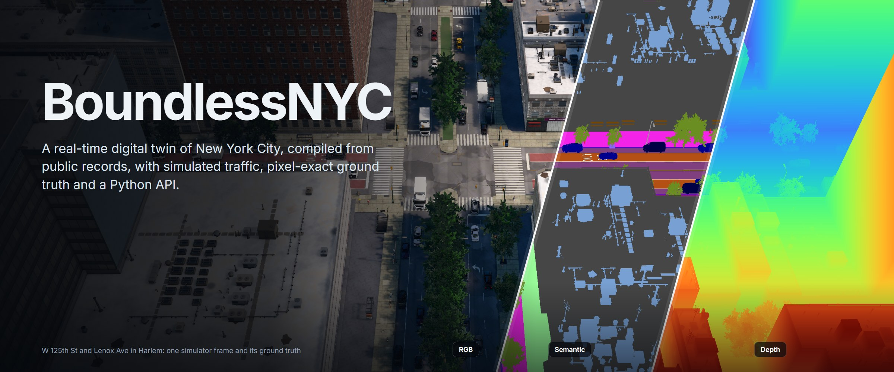
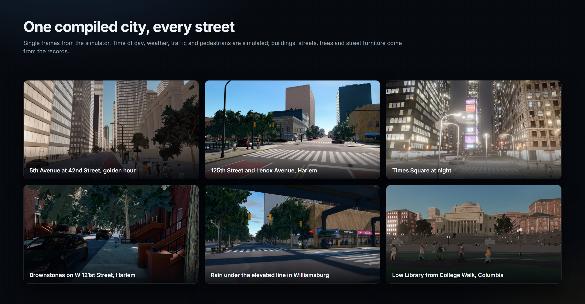

# BoundlessNYC: interactive demo

A real-time WebGL2 rendering of BoundlessNYC, a digital twin of Manhattan, the Bronx, Brooklyn and Queens compiled
from public municipal records. It includes 937,965 buildings, the street network with its recorded lane geometry,
street trees and street furniture, and simulated traffic and pedestrians. The browser streams 512 m tiles within
1 km of the camera and far-field tiles within 13 km, so it loads only the neighbourhood around the camera at full
detail. The full city is 2.4 GB.

**Requirements.** A desktop browser with WebGL2 (a current Chrome or Edge is recommended) and a discrete GPU. If mouse
look does not engage inside the embedded page, open the app in its own tab.

| Input | Action |
|---|---|
| click, then W A S D and mouse | move and look |
| Shift / Ctrl | rise / descend |
| Tab | toggle free-flying camera and first-person pedestrian view |
| 1 – 6 | teleport: Morningside Heights, Harlem 125th St, Times Square, Midtown 34th St, Civic Center, Financial District |
| T / R | time of day / rain |
| G | graphics and weather editor |
| P | hide the HUD |
| H | help |

**Implementation.** This Space runs no simulation server. `server.mjs` is a dependency-free static server. It serves
the `Content/` folder of the dataset `mehmetkeremturkcan/boundless-nyc`, mounted read-only at `/data` as a Space
volume. All rendering and simulation run in the browser. The simulation server with the Python API (synchronous
stepping, sensors, ground truth) is distributed as a desktop build; see the repository.

**Credits.** City data: NYC Open Data, NY State open data and © OpenStreetMap contributors (ODbL 1.0). Vehicle and
pedestrian models: CARLA Simulator (carla.org), CC BY 4.0. Motion data: 100STYLE (CC BY 4.0). Textures and skies:
Poly Haven and ambientCG (CC0). The complete list is in `ACKNOWLEDGEMENTS.md` in the repository.

**Licensing.** The server code is MIT and the compiled city ODbL 1.0. The photoreal pedestrians contain components
created with Epic Games' MetaHuman, which may not be used to build or enhance a database or to train or test AI
models; `LICENSING.md` in the
repository explains the notice and the procedural alternative.

**Citation.** M. K. Turkcan, Y. Li, C. Zang, J. Ghaderi, G. Zussman and Z. Kostic. *Boundless: Generating
photorealistic synthetic data for object detection in urban streetscapes.* arXiv:2409.03022, 2024.
